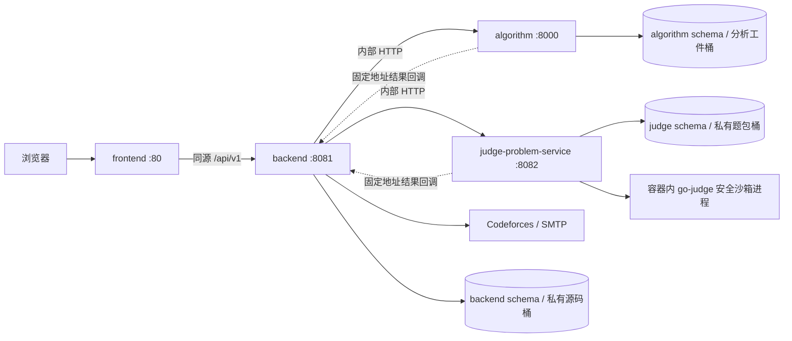

# V0.2 整体架构与联调说明

契约发布号 **0.2.0**。公开 API 继续 `/api/v1`；新增服务间 API 为 `/internal/v2`，已有 `/internal/v1` 保留。本文与同目录八份负责人文档组成一次完整交付。本轮只设计接口与数据，不修改业务代码。

## 1. 四容器架构

PostgreSQL、Redis、对象存储可独立部署，图中三个 schema 可处于同一 PostgreSQL 实例，但使用不同服务账户。Redis 只做限流、缓存或唤醒，不能作为唯一任务记录。仅 frontend 发布宿主入口；TLS 在入口终止。容器间使用服务名，浏览器访问同源路径。go-judge 是判题业务容器内的上游沙箱组件，通过同容器 `127.0.0.1:5050` 的私有 REST 接入，配置独立内部 token，不是新增业务容器；部署时必须验证宿主内核、cgroup、seccomp 与最小所需权限。

各业务镜像独立 Dockerfile、依赖锁、构建上下文、启动与健康检查；backend、algorithm、judge 各自的 HTTP、调度/任务恢复进程在所属容器内运行。禁止依赖其他负责人的源码、ORM 或镜像构建目录。启动顺序由健康状态和重试保障，不能靠固定 sleep。

## 2. 服务职责与唯一数据 owner

| 服务 | 唯一拥有与修改的数据 | 通过接口使用的数据 |
|---|---|---|
| frontend | 页面、编辑器本地草稿、客户端状态；无业务表 | 只访问 backend，跳外部题链接属于页面导航 |
| backend | 用户、认证/RBAC、CF 绑定及外部目录/提交、平台业务 Submission/源码、训练记录、画像业务快照、推荐交付批次、团队/隐私/报告/通知、结果展示投影与派发/去重记录 | 平台题目通过 judge 获取；原始判题事实、静态分析事实通过内部 API 接收 |
| algorithm | 持久分析/画像计算任务、静态分析原始结果、工具版本与可复现工件、回调 outbox | backend 提供冻结事件、题目、画像与特征；不直接查询 backend/judge 表或 Codeforces |
| judge-problem-service | 平台题目目录、不可变题包版本、测试/validator/reference、许可证溯源、导入任务、JudgeTask 与原始判题结果、回调 outbox | backend 提供 submissionId、固定题目版本和私有源码 |

backend 的目录缓存、判题/分析投影必须保存来源 ID、版本或 revision，禁止把它们当第二份可编辑主数据。算法画像计算输出仅为计算工件，正式用户画像仍由 backend 校验后追加。内部四方向凭据统一命名为BACKEND_ALGORITHM_TOKEN、BACKEND_JUDGE_TOKEN、ALGORITHM_BACKEND_TOKEN、JUDGE_BACKEND_TOKEN；旧INTERNAL_API_TOKEN只用于保留的v1。跨 owner 关联是逻辑引用，不建跨 schema 外键、不给其他服务业务表写权限。各自账户只迁移所属 schema/桶；源码、隐藏测试和标准程序不提供公共存储 URL。

旧 V0.11 的 CF 单账号功能，以及 V0.12 的多 CF 用户画像、团队、隐私、报告、通知和既有 P2 能力保持原接口/语义。旧 `/me/analysis/**` 继续 CF 聚合；新增 `/me/learning-profile/**` 用于平台与外部训练的综合画像。旧团队与报告不会自动获得平台源码或平台学习数据。V0.1 已被后续设计升级的任意 `user_id`、数值 ID、单 CF 限制及旧评分格式不重新启用。

## 3. 服务调用关系与文档分工

| 调用 | 契约与目的 |
|---|---|
| frontend → backend | `/api/v1/**`：身份与旧功能、平台题库、语言能力、提交/源码/分析、训练、综合画像、内外题推荐 |
| backend → judge | `/internal/v2/problems`、版本详情、`languages`、`catalog-snapshots`、`judge-tasks`、导入/发布/撤题 |
| backend → algorithm | 旧 `/internal/v1/*`；新 `/internal/v2/analysis-jobs`、`profile-jobs`、`recommendations`、`capabilities` |
| judge → backend | `POST /internal/v2/events/judge`，只回传已派发任务的完整结果快照 |
| algorithm → backend | `POST /internal/v2/events/algorithm`，只回传分析/画像任务的完整快照 |

下游回调不用于拉取业务数据，algorithm 与 judge 之间没有调用。上述反馈边是异步任务完成通知，不形成互相等待的循环。公开请求使用 `cst_session` Cookie、7 天有效、写请求 Origin 校验；内部使用调用方专属 Bearer secret 与 `X-Request-Id`，四个方向的 secret 独立。客户端不得携带内部凭据；回调 URL 由部署配置固定。

| 负责人 | 独立实施时阅读 |
|---|---|
| 前端 | [前端api文档.md](前端api文档.md)、[前端需要知道的数据库.md](前端需要知道的数据库.md)、本文 |
| 后端 | [后端api文档.md](后端api文档.md)、[后端数据库文档.md](后端数据库文档.md)、本文 |
| 算法 | [算法模块api文档.md](算法模块api文档.md)、[算法模块数据库文档.md](算法模块数据库文档.md)、本文 |
| 判题与题库 | [判题题库api文档.md](判题题库api文档.md)、[判题题库数据库文档.md](判题题库数据库文档.md)、本文 |

每组文档必须自包含本组所需请求/响应和历史兼容签名，按契约建立 mock，不等待其他仓库完成才开发。

## 4. 关键公共数据结构

| 概念 | 统一约定 |
|---|---|
| 字段/时间/分页 | JSON camelCase、DB snake_case；UTC RFC3339 `Z`；统计 `Asia/Shanghai`、四窗口 `[start,end)`；page=1/pageSize=20/max100 |
| 成功/错误 | `{data,requestId}`；分页额外 `meta:{page,pageSize,total,hasNext}`；`{error:{code,message,details},requestId}`；204 无体；nullable 显式 null、数组空为 [] |
| ID | 用户 publicId、版本/任务/快照/批次为 UUID；accountId/problemId/submissionId 为正十进制字符串，不转 JS number |
| ProblemRef | `{source:"PLATFORM"\|"EXTERNAL",platform:"startrack"\|"codeforces",problemId,problemVersionId}`；平台须固定 UUID 版本，外部版本 null；题目身份为前三字段，不能只按 problemId 关联 |
| Submission | backend 主数据；新 platform_submissions 与旧 CF submissions 共用 ID 分配序列，旧 ID 与非空外键不变；platform Submission 关联 judgeTaskId/analysisId 与独立状态、judgeError/analysisError；下游未接收的确定拒绝须本地终态失败，不伪造判题结果 |
| 结果事件 | `{eventId,eventType,occurredAt,requestId,aggregateId,revision,payload}`；完整任务快照、任务内 revision 单调；重复/旧 revision 200 确认，同 revision 不同内容 409 EVENT_CONFLICT |
| 判题状态 | QUEUED → DISPATCHING → RUNNING → COMPLETED；基础设施 FAILED，取消 CANCELLED；短 verdict AC/WA/TLE/MLE/RE/CE/OLE/IE 与旧训练 Verdict 显式映射，IE 不当用户答错 |
| 分析状态 | NOT_REQUESTED/QUEUED/RUNNING/SUCCEEDED/PARTIAL/FAILED/SKIPPED；PARTIAL 有可用结果；换任务重试先比 analysisId，不能跨任务比较 revision |
| 难度/度量 | CF_RATING、PLATFORM_RATING、UNRATED 显式标明，缺失 null；不同尺度不混算；timeMs 毫秒、memoryBytes 字节；圈复杂度不等同 Big-O |
| 新版本 | learning-profile-v0.2.1、learning-recommend-v0.2.1、static-v0.2.1；映射仍 mapping-v0.11.1；旧版本号不替换 |

新画像 `sourceFingerprint` 由 backend 用 RFC8785/JCS 规范 JSON 的 SHA-256 生成，冻结当前未解绑 CF 账号版本/状态、外部与平台目录版本、platformTrainingVersion、analysisFeaturesVersion 及算法/映射版本。算法只回显；落库前重新核对，变化则重排任务。目录无内容变化不推进版本，重复回调不推进训练/特征版本。旧指纹继续旧格式；新计数与旧目录任务 UUID 的映射由 backend 维护。查询新画像时还判断 INVALID 数据源、同步在途、版本变化及超过 24 小时等 stale 条件。

## 5. 核心数据流

1. **题库入库**：ADMIN 经 backend 提交锁定上游 commit 的导入请求 → judge 保留原件与许可 → oj-lab 题包兼容层 → problemtools 与资源/标准程序验证 → 生成不可变版本 → 发布。backend 完整拉取同一个 catalog snapshot 后原子更新只读推荐候选缓存，撤题也推进目录版本。
2. **平台做题**：题目详情与动态语言能力 → 编辑源码 → 带 Idempotency-Key 提交固定 ProblemRef → backend 事务保存 Submission/源码/训练链接及 outbox → judge 校验版本/语言、按 go-judge-demo 流程调度上游 go-judge → 判题结果事务保存并回传 → backend 更新投影与训练记录。
3. **分析与画像**：判题终态立即可见并触发基础画像；代码分析异步使用 Lizard/clang-tidy/Infer/CPD（Python Radon、Java PMD 为声明能力的扩展）→ 统一 metrics/findings/tools/reproducibility → backend 保存只读展示投影并推进特征版本 → 重建四窗口综合画像。工具失败不回滚判题；代码质量单独统计，不暗改旧六维公式；PARTIAL 重试时保留最近可用分析证据，新可用结果替换后才推进特征版本；Agent/LLM 综合分析接口本轮保持 NOT_REQUESTED。
4. **推荐闭环**：新 ALL 画像与冻结候选 → backend 调算法统一内外题排序 → 校验并冻结交付批次 → 平台进入本地题面，外部仅跳原题 → 训练结果产生新事件 → 更新画像 → 再推荐。CF 公开提交无源码，不自动做代码分析；外部点击不是完成，实际同步 AC 才完成训练。
5. **故障恢复**：派发/结果与 outbox 同事务；服务以 requestId 去重；回调重试、backend 每 30 秒轮询对账并通过 by-request 找回响应丢失的任务；lease 到期恢复。接收不确定的本地派发失败仍按原requestId对账，恢复真实任务状态；明确拒绝不复活，原始JudgeTask终态不改。隐藏测试、答案、用户程序输出与私有路径不返回前端。重启与重复通知不能产生第二次提交、重复计分或覆盖历史。

judge 采用成熟上游的封装与二次开发：`criyle/go-judge-demo` 提供流程参考，`criyle/go-judge` 提供执行隔离，`oj-lab/problem-packages` 提供首批题源，`Kattis/problemtools` 提供校验。原件、来源 commit、许可证/NOTICE、适配版本与升级回归记录必须保留；题包许可逐题核验，未知许可不得发布。禁止将四个项目复制为一套无来源的自研 OJ。

## 6. 联调顺序

1. 锁定本轮公共 DTO、错误码与 mock；各人独立构建镜像和健康检查；基础设施按 owner 创建账户/schema/桶。先回归原有认证、CF、团队/隐私、报告/通知，不重新建旧表。
2. 题库负责人完成一包合法导入/校验/发布、目录快照、版本详情与语言能力；后端代理；前端完成题面与编辑器。
3. 后端用 judge mock 完成提交幂等、outbox、回调/轮询恢复；切真实 go-judge 验证 AC、WA、CE、TLE、MLE、RE、OLE 与 IE 分离。随后接提交记录与训练投影。
4. 算法先提供可复现静态分析 fixture；接入后台派发、PARTIAL/FAILED/SKIPPED 与重试，再接四窗口综合画像和内外题推荐。Agent/LLM 扩展不作为本轮闭环依赖，旧报告已启用的 LLM 能力照旧回归。
5. 前端接真实后端；在同一服务器四业务容器环境验证容器重启、断网重试、权限、版本更新及完整闭环，不用开发机器 localhost 代替容器地址。

## 7. 最终验收闭环

- 同一合法题包可追溯来源与许可，校验失败/许可未知不可发布；撤题停止新提交，历史提交仍引用原版本。
- 登录 → 平台题库 → 在线编辑 → 幂等提交 → 异步判题 → 提交/训练记录 → 独立代码分析 → 四窗口画像 → 平台与外部推荐 → 再训练全程可运行。
- 判题成功、分析失败时前端仍显示正确判题结果；重复/乱序回调、POST 响应丢失及服务重启不重复生成事实；任务最终可恢复或明确终态失败。
- 外部账号同步、Gym 占位、缺失 rating、团队重复事件去重、多 CF 解绑历史隔离维持正确；新平台题与同数字 CF 题不会串联；默认隐私 PRIVATE，旧团队接口不泄漏平台源码。
- 四个业务容器可独立构建并同机部署；algorithm/judge 宕机不影响旧认证/团队业务；每张业务表与存储对象只有一个可写 owner；除业务结果回传无循环依赖。
