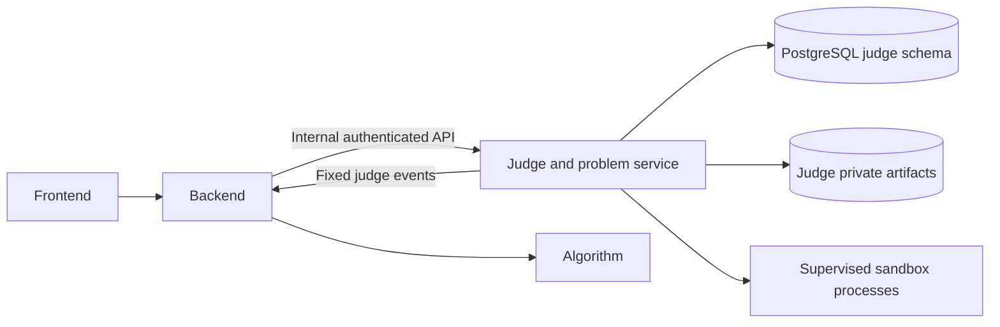

# Architecture and ownership

Code Startrack Judge & Problem Service owns platform problems and recoverable raw judgment facts. It receives trusted internal requests from backend; backend controls the public user experience and all user authorization. The target release is V0.2 under contract `0.2.0`. Phase 0 provides the engineering foundation; the modules below are planned implementation boundaries, not deployed functionality.

Read the [active contracts](../contracts/README.md) before implementation. This overview explains their architectural consequences and does not replace their DTOs, constraints, error codes, or acceptance criteria.

## Service boundaries

| Owner | Owns | Must not delegate implicitly to judge |
|---|---|---|
| Judge/problem service | Platform identity and immutable versions; private packages/tests/reference programs; package validation and license provenance; catalog versions/snapshots; JudgeTasks and immutable raw results; callback outbox | Its database facts cannot be rewritten by backend caches or public projections |
| Backend | Users, RBAC, sessions, CF data, business Submission, long-term submitted source, training data, public result projections, orchestration and profiles/recommendations | Authorization, source ownership, CF identity and algorithm orchestration remain backend responsibilities |
| Algorithm | Static analysis tasks and raw analysis facts | Judge must not call algorithm, own analysis tables, or fail valid judgment because analysis is unavailable |
| Frontend | User interface through backend APIs | It must not call judge directly or receive hidden package data |

Platform and external CF IDs share a string representation but not an identity namespace. Use all `ProblemRef` identity fields at boundaries. There are no cross-service foreign keys, direct backend/algorithm table access, replicated user tables, or shared business credentials.

This is the service-local boundary. The missing referenced whole-system contract is tracked as [Q-001](../contracts/open-questions.md#q-001--missing-whole-system-architecture-contract); no full four-service deployment topology is inferred from this diagram.

## Planned modules and ownership seams

| Module | Responsibility | Shared boundary to freeze before parallel implementation |
|---|---|---|
| Internal HTTP/configuration | Strict DTOs, S2S authentication, request identity, body limits, capability-aware health | Contract DTOs and shared canonical hash vectors |
| PostgreSQL repositories/migrations | Judge-only data access, transactional integrity and forward migration history | Contract constraints, transaction boundaries and schema-level integration tests |
| Problem/version domain | Stable identities, immutable metadata, publish/withdraw and catalog changes | Version/artifact linkage, same-problem constraints and idempotent mutation outcomes |
| Package import/compatibility | Fixed OJ-Lab commit acquisition, safe extraction, manifest generation, license evidence, problemtools adapter | Typed manifest, checksums, conversion policy and registered adaptations |
| Catalog | Safe public projections, consistent snapshots and withdrawal tombstones | Snapshot identity/version/cursor rules and backend cache swap tests |
| Language/runtime adapter | Versioned service-owned templates, frozen execution input, upstream protocol conversion | No caller commands; explicit verdict/checker/resource mappings |
| Persistent workers | Leased scheduling, fencing, recovery, immutable results/cases | Recovery graph, attempt budget and atomic terminal commit |
| Callback delivery | Transactional event snapshots, stable event IDs, durable retry/dead letters | Backend inbox/polling convergence and canonical event hashes |

Keep adapters separate from pinned upstream source. A Go business service is a strong candidate because the pinned demo/runtime are Go; the bootstrap workstream must record the actual language/toolchain choice after reading upstream build constraints. Do not introduce a microservice or framework for each module. Implement the smallest service that preserves these seams.

## Durable facts and reproducibility

The database owns task and catalog truth, not an in-memory channel or Redis pubsub. Successful task acceptance includes persisted task/queue facts, registered transient source, and the initial outbox event. Worker leases use short database transactions; execution happens outside those transactions. Every visible state/result change advances revision; terminal facts remain final.

Problem identity persists across imports. Problem versions, package bytes, test order, checker behavior, license evidence, language configuration, execution limits, sandbox version and actual toolchain image digest make a historical judgment understandable. Updating a published problem does not change an accepted task's input. Withdrawal blocks new submissions and retains old records and artifacts.

The service retains source hashes and results; backend retains the long-term source. The judge's transient source/workspace is cleaned 24 hours after terminal completion under the contract. Re-execution later therefore requires a separately authorized source handoff from backend plus retained toolchain/runtime artifacts; Phase 0 must not claim a public rejudge API or indefinitely retained judge source.

Objects and database rows cannot share a physical transaction. Write checksum-named private objects first, register them in a short transaction, and reconcile orphaned objects when registration fails. Never announce task/import acceptance before its required durable facts exist.

## Runtime and security boundary

V0.2 specifies one `judge-problem-service` business container: a nonroot API/persistent worker plus supervised demo judger and go-judge processes. Its public internal listener is `0.0.0.0:8082`; the bottom-level go-judge listener is `127.0.0.1:5050`, with an independent token and no published host port. This contract does not authorize a fifth business container.

Process supervision, user/capability separation, environment allowlists, cgroup delegation and mounts need real Linux qualification. Keeping processes in one container does not itself prove privilege or credential separation. The sandbox process receives no database/backend/S2S secrets; API and import workers submit only minimum frozen execution inputs. User programs, reference solutions, validators and checkers are untrusted.

The pinned demo/runtime use different default transports/ports; [Q-008](../contracts/open-questions.md#q-008--bottom-level-transport-and-binding-reconciliation) must be settled before wiring them. The pinned go-judge startup code also logs its configuration and bottom-level auth token in normal logging paths. Runtime integration must prevent those secret disclosures through verified configuration or a minimal reviewed, provenance-tracked logging patch. Pinning upstream is not evidence that its default deployment/logging meets this service's security contract.

Portable development covers database, DTOs, metadata, mocks and non-security-critical tests. Only an appropriate Linux host can validate cgroups, seccomp, namespaces, filesystem/network isolation and CPU/wall/memory/output limits. go-judge must use `--no-fallback`; seccomp must stay enabled. Missing isolation makes judge readiness fail and stops new execution, while safe historical reads can remain available. Production capacity must bound sandbox concurrency so co-hosted backend/algorithm work stays healthy.

## Decisions and remaining gates

The [ADR index](../adr/README.md) records the intentional architecture. The [implementation plan](implementation-plan.md) assigns dependent workstreams and evidence gates. [Open questions](../contracts/open-questions.md) identify details that require owner reconciliation before affected interfaces are implemented. None of these documents authorizes silent contract changes or claims production readiness.
