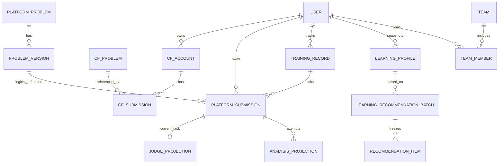

# V0.2 前端需要知道的数据库

契约发布号：`0.2.0`。本文解释页面所见数据的主数据 owner、关联、字段与约束；完整 JSON 字段签名在同组《前端api文档.md》中，两份一起即可实施。frontend 无业务数据库、无SQL权限、无服务令牌，不承担任何业务表 owner。以下“集合”是 API 只读视图，不是要求前端建表。

## 1. 唯一数据 owner

| 主数据 / 数据源 | 唯一 owner | 前端读取方式 | 约束 |
|---|---|---|---|
| 用户、认证、RBAC、团队、申请、邀请、隐私、通知、报告 | backend | `/me`、旧团队/隐私/通知/报告API | 继续既有权限与字段 |
| CF绑定、CF题目、CF原始/标准化提交、rating、旧画像/推荐 | backend | `/oj-accounts/**`、旧 `/me/analysis/**` | 原有CF语义不变 |
| 平台题目、不可变题包版本、题面、测试/参考方案、目录版本、许可来源 | judge-problem-service | backend代理 `/platform-problems/**` | backend缓存只读；frontend不获取题包或隐藏数据 |
| 平台Submission与私有源码、训练记录 | backend | `/submissions/**`、`/me/training-records/**` | 只有backend修改主数据 |
| 原始判题任务及结果 | judge-problem-service | backend的Submission判题投影 | 投影只接受当前任务的单调revision |
| 静态分析任务、工具原始工件、可复现结果 | algorithm | backend的Submission分析投影 | algorithm不改提交、训练或画像业务表 |
| 综合画像快照、交付推荐批次 | backend | `/me/learning-profile/**`、`/me/recommendations/**` | algorithm只计算冻结输入/输出 |
| Redis、对象/题包存储 | 各bucket/key的上述owner | 不向frontend提供连接或写入凭据 | 服务间工件副本带来源与版本，不成为第二主数据 |

四容器仅 frontend→backend，backend→algorithm/judge 请求；两个下游回调只传既有任务完整快照。前端理解这些关系后仍只读 backend API，不能通过共享数据库合并服务数据。

## 2. ID、类型与关系

| API字段 | JSON / 逻辑存储类型 | 主键 / 关联含义 |
|---|---|---|
| publicId | UUID string / uuid | users的公开身份，内部users.id不向前端泄露 |
| accountId | 正十进制string / bigint | 一次CF绑定PK，handle不是PK |
| problemId | 正十进制string / bigint | 每owner独立题目PK；必须连source/platform一起使用 |
| problemVersionId | UUID string或null / uuid | 平台不可变版本逻辑关联；外部恒null |
| submissionId | 正十进制string / bigint | backend提交PK；CF旧表与平台新表共用序列，所有backend提交ID唯一 |
| judgeTaskId / analysisId / profileJobId | UUID string或null / uuid | 远程任务逻辑关联，不建跨owner FK |
| trainingRecordId / snapshotId / batchId / jobId | UUID string / uuid | backend训练记录/快照/推荐/调度任务PK |
| teamId / membershipId / applicationId / invitationId / notificationId / reportId | UUID string / uuid | 旧业务稳定PK |
| externalSubmissionId | 正十进制string / varchar或bigint标准化值 | CF原事件ID，用户汇总按platform+此ID去重 |
| sourceFingerprint / resultHash / sourceSha256 / configSha256 | 64位小写hex string / char(64) | 冻结版本/内容摘要；不是授权凭据 |
| 所有Instant | RFC3339 UTC Z / timestamptz | 显示可转本地，统计时区Asia/Shanghai |
| count、rank、revision | 非负安全整数number / integer或bigint | 不用ID数值参与计算，rank从1连续 |
| 分数 | number / numeric | 六维0..100；推荐0..1；不允许NaN/Infinity |
| 嵌套结构、数组 | JSON object/array / jsonb或关联表 | 数组永远[]；nullable显式null |

`logical_reference`是跨服务API关联，不是允许frontend或backend直接写judge表。平台题目从一个版本更新到下一个版本时仍是同题：训练/AC去重键不包含版本，源码与判题冻结版本则必须包含版本。

## 3. 平台题库只读集合

集合 `PlatformProblemSummary/Detail` 的主事实由judge的题目与版本表保存，backend只组合成授权后的公开视图。列表字段如下，Detail追加题面/样例/许可。

| 字段 | JSON类型 | 约束 / 用途 |
|---|---|---|
| problemRef.source / platform | PLATFORM / startrack | 固定平台命名空间 |
| problemRef.problemId | Id | 题目PK，导航/缓存 |
| problemRef.problemVersionId | UUID | 非空、不可变版本，提交必须原样回传 |
| title | string或null | 发布时非空；旧外部占位才可能null |
| difficulty | number或null | 有可信标定为正整数，否则null |
| difficultyScale | PLATFORM_RATING / UNRATED | UNRATED要求null；不冒充CF官方rating |
| tags | string[] | 去重，≤32项，每项1..128；自由文本 |
| url | null | 内部导航使用problemId |
| status | DRAFT/PUBLISHED/WITHDRAWN | 普通读取仅PUBLISHED；历史版可返回当前WITHDRAWN |
| catalogVersion | Id | 目录全局版本，变更公开属性/发布/撤下递增 |
| timeLimitMs | number | 正整数，CPU毫秒 |
| memoryLimitBytes | number | 正整数，字节 |
| languageIds | string[] | 此题实际可提交语言，与judge-languages能力取交集 |
| updatedAt | Instant | 公开变更时间；DRAFT预览为版本创建时间，不因新草稿改变公开列表排序 |
| statement.format / content | MARKDOWN / string | 完整题面；content不因分节可提取而裁减 |
| statement.input / output | string或null | 可提取输入/输出说明；不可提取为null |
| samples | `{input:string,output:string}[]` | 仅公开样例；空数组允许 |
| license.spdxId | string或null | 许可标识，不识别则null但仍保存notice |
| license.notice / sourceUrl | string / string | 原许可说明和题包来源，页面保留出处 |

普通列表建议owner索引 `(status,public_updated_at DESC,id DESC)`、tags索引；这些由judge负责人实施，frontend只按排序分页。详情历史版的题包字段冻结，从未发布该version时status=DRAFT，曾发布时status为题目当前PUBLISHED/WITHDRAWN，catalogVersion总是当前目录版本；撤题不删除Submission历史。管理metadata-versions创建DRAFT新版本，不修改旧版本，后续publish切当前引用。

语言能力集合 `LanguageCapabilities`：capabilityVersion:string、languages:LanguageCapability[]；每项languageId/displayName/languageFamily/compilerVersion/sourceFilename:string、analysisSupported:boolean。languageId为接口代码，不用显示名称作为主键；首次至少cpp17。analysisSupported由backend取judge支持与algorithm真实可用语言交集，算法暂不可达false仍可判题，不当成永久不支持。公开capabilityVersion由backend对judge内部版本与最终公开languages做JCS/SHA-256派生，能力交集改变时同步改变，不直接沿用judge内部版本。

导入管理集合 `ImportJob`：importJobId:UUID为PK；requestId:UUID关联backend请求；revision:非负整数单调；status:QUEUED/RUNNING/SUCCEEDED/PARTIAL/FAILED；error:TaskError|null；createdAt/updatedAt:Instant、finishedAt:Instant|null；source固定OJ_LAB、repositoryUrl固定源仓库、sourceRevision为40位commit；packageCount/completedPackageCount:非负整数，items:ImportItem[]。每项packagePath:string、status:PENDING/VALIDATED/REJECTED、problemId:Id|null、problemVersionId:UUID|null、licenseStatus:PENDING/VERIFIED/MISSING/REVIEW_REQUIRED、validationStatus:PENDING/PASSED/FAILED、errors:TaskError[]。完成校验产生DRAFT版本；PARTIAL是部分题包拒绝，不隐藏失败包。

## 4. 平台Submission与源码

backend新增 `platform_submissions`；既有CF `submissions.account_id/problem_id/external_submission_id` 保持非空及原FK，不把平台提交硬塞入旧表。

| 字段 / 视图 | JSON类型 | 关联 / 约束 / 用途 |
|---|---|---|
| submissionId | Id | PK，backend与旧CF共用ID序列 |
| problem | ProblemSummary | 冻结提交所用题版本；逻辑关联judge owner |
| languageId | string | 已验证能力代码，提交后不变 |
| judgeTaskId | UUID或null | 当前远程判题任务；未创建远程任务可null |
| judgeStatus | JudgeStatus | QUEUED/DISPATCHING/RUNNING/COMPLETED/FAILED/CANCELLED |
| judgeRevision | number | 当前task内单调，不回退 |
| judgeResult | JudgeResult或null | 真实远程判题结果；本地派发拒绝/未完成为null |
| judgeError | TaskError或null | 在途/成功null；FAILED明确原因与retryable |
| analysisId | UUID或null | 当前分析尝试，不等于最近可用画像证据 |
| analysisStatus | AnalysisStatus | 与judge独立状态机 |
| analysisRevision | number | 当前analysisId内单调，新任务不可拿旧revision比较 |
| analysisError | TaskError或null | 当前分析任务失败/跳过说明 |
| submittedAt / updatedAt | Instant | 用户提交时间 / 投影最近变更时间 |

源码由backend.submission_sources保存或引用其私有桶；judge_result_projections/code_analysis_projections是下游任务投影。只有backend持有用户归属与源码主事实，judge/algorithm只保存计算冻结副本；frontend不保存远程任务的原始结果。索引由backend负责：`(user_id,submitted_at DESC,id DESC)`、按本人problem/status过滤的组合索引。

源码集合 `{submissionId:Id,sourceCode:string,sourceSha256:string,languageId:string}`：submissionId唯一逻辑FK至平台Submission，UTF-8源码≤262144bytes；摘要按原字节计算。GET只本人，private/no-store。源码不可凭COACH或旧detailedSubmissions隐私设置共享。2MiB是普通创建输入限制，公开分析结果读取可达32MiB但不含工具raw报告。

JudgeResult字段：verdict:AC/WA/TLE/MLE/RE/CE/OLE/IE；timeMs/memoryBytes:number|null（未运行null）；passedTestCount/totalTestCount:非负整数且passed≤total；score:number|null（二元判题null）；compileLog:string|null（本人/管理员、≤16384bytes、脱敏）；diagnosticCode:string|null；judgedAt:Instant。不能获取隐藏测试输入/答案/路径及程序stdout/stderr。IE属于基础设施失败，不计用户能力失败；本地FAILED可以result=null，按judgeError展示；接收不确定的可恢复失败仍由后台对账，后续真实任务状态可替换本地失败提示。

## 5. 代码分析结果与画像证据

backend保留当前任务投影与最近可用静态结果，algorithm保存任务/工具原始事实。`SubmissionAnalysisView` 字段为analysisId:UUID|null、status:AnalysisStatus、revision:number、result:StaticAnalysisResult|null、error:TaskError|null；analysisId改变表示重试新任务。

| 静态结果字段 | 类型 | 约束 / 用途 |
|---|---|---|
| schemaVersion | 0.2.0 | 输出结构版本 |
| analysisId / submissionId | UUID / Id | 结果PK逻辑关联同一平台提交 |
| sourceSha256 / languageId | hash / string | 必须与提交源码/语言相同 |
| toolchainVersion / resultHash | string / hash | 工具链与结果内容身份 |
| metrics | AnalysisMetrics | sourceLines/functionCount/maxCyclomaticComplexity/meanCyclomaticComplexity/duplicateLines/maintainabilityIndex，各number\|null |
| findings | AnalysisFinding[] | 每项findingId/tool/ruleId/message/file:string；severity:INFO/WARNING/ERROR；category:COMPLEXITY/BUG_RISK/STYLE/PERFORMANCE/DUPLICATION；startLine/endLine:number、column:number\|null |
| tools | ToolRun[] | tool/version/configSha256:string；status:SUCCEEDED/FAILED/SKIPPED；durationMs:非负整数；error:TaskError\|null |
| reproducibility | object | imageDigest/configSha256/sourceSha256:string；用于复现定位 |
| synthesis | object | status=NOT_REQUESTED；provider/model/promptVersion/content/error本版全null；后续独立授权/版本扩展 |

所有位置1-based，file为逻辑相对路径；缺少工具指标不填0假装测量成功。PARTIAL仍可展示/参与画像的结构化证据；FAILED无可用新结果。重试PARTIAL时当前result可能null，但后台继续使用最近一次可用SUCCEEDED/PARTIAL结果；新失败也不清除旧证据。只有新可用结果落库才推进analysisFeaturesVersion，不能因点击retry把codeQuality归零。

TaskError的code/message:string、retryable:boolean；工具失败由对应工具状态表达，不修改源码、判题和训练结果。Lizard圈复杂度与CPD提交内重复有具体用途，但不证明Big-O或跨用户抄袭。

## 6. 训练记录集合

训练记录为backend owner的training_records统一业务投影，不是新的Submission事实。唯一 `(user_id,source,platform,problem_id)`，版本不参与去重；平台和CF实际事件合并后更新，重试回调不增加attemptCount。backend负责按用户更新时间索引。

| 字段 | 类型 | 关联 / 约束 / 用途 |
|---|---|---|
| trainingRecordId | UUID | PK |
| problem | ProblemSummary | 当前训练视图与源命名空间；不抹掉Submission冻结版本 |
| status | PLANNED/IN_PROGRESS/COMPLETED | 计划/实际尝试/至少一次AC |
| recommendationBatchId | UUID或null | 只关联本轮learning_recommendation_batches的本人交付批次且包含此题；不接旧CF/团队batchId |
| firstSubmittedAt / lastSubmittedAt | Instant或null | 无实际提交时null |
| attemptCount / acceptedSubmissionCount | number | 非负，accepted≤attempt；真实事件计数，不是点击次数 |
| lastSubmissionId | Id或null | 最后实际提交逻辑引用 |
| completedAt | Instant或null | 首次AC时间；无AC为null |
| createdAt / updatedAt | Instant | 首次记录创建与最近事实投影变化 |

PLANNED不进入画像提交统计。不同key重复计划200返回既有记录；首次非空推荐归因冻结。CF重评撤销全部有效AC时可COMPLETED→IN_PROGRESS，completedAt按有效事实重算。平台选题后直接submit也能自动创建记录；外部必须同步到真实CF结果，点击原站链接不能变COMPLETED，外部无源码不分析。failed IE/取消保留提交历史，不能算能力失败。查看记录要保留source标签，不能把两来源同值problemId并作一题。

## 7. 综合学习画像与推荐

综合画像是新的backend.learning_profile_snapshots业务快照集合，旧analysis_snapshots、user_analysis_snapshots继续CF-only。每次综合计算四窗口一起冻结、一起落库；来源版本变化会生成新snapshotId，不覆盖历史。

| 综合画像字段 | 类型 | 约束 / 用途 |
|---|---|---|
| publicId / snapshotId / profileJobId | UUID | 用户公开身份/快照PK/计算任务逻辑关联 |
| window / period | 7D/30D/365D/ALL / `{start:Instant\|null,end:Instant}` | ALL start=null；[start,end) |
| summary | Summary | 公共计数字段见下表 |
| currentRating / maxRating | number或null | 参与CF账号非null最大值，平台训练不造CF Rating |
| overallScore / dimensions / weakestDimension | number / DimensionScore[] / DimensionCode | 0..100、六项按displayOrder、弱项rankOrder=1 |
| tagStats | TagStat[] | tag:string+attemptedProblemCount/solvedCount/submissionCount:非负整数 |
| difficultyStats | LearningDifficultyStat[] | difficulty:number\|null、difficultyScale、attemptedProblemCount/solvedCount:非负整数；按尺度独立桶 |
| activityStats | ActivityStat[] | date:YYYY-MM-DD与submission/accepted/failed/pending/solved计数；只活跃日 |
| sourceFingerprint | hash | 后端冻结源版本身份，不能前端计算 |
| algorithmVersion / mappingVersion | learning-profile-v0.2.1 / mapping-v0.11.1 | 不覆盖旧profile版本 |
| timezone / dataCutoffAt / createdAt / stale | Asia/Shanghai / Instant / Instant / boolean | 后端派生stale；历史真实显示 |
| sources | object | platformSubmissionCount/externalSubmissionCount/codeAnalysisCount:number；sourceAccountIds:Id[] |
| codeQuality | object | analyzedSubmissionCount/warningCount/errorCount:number；maxCyclomaticComplexity:number\|null |

Summary字段均保留：attemptedProblemCount、solvedCount、unsolvedProblemCount、submissionCount、acceptedSubmissionCount、failedSubmissionCount、pendingSubmissionCount、ratedSolvedCount、unratedSolvedCount、activeDays 为非负整数；averageSolvedDifficulty:number|null、maxSolvedDifficulty:number|null。约束：solved≤attempted≤submission；unsolved=attempted−solved；accepted+failed+pending=submission；rated+unrated=solved。

DimensionScore字段：code为固定六维code、name:string、displayOrder整数1..6、score:0..100、attemptedProblemCount/solvedCount/submissionCount:非负整数、averageSolvedDifficulty:number|null、rankOrder整数1..6。固定六维是IMPLEMENTATION/ALGORITHMS/DATA_STRUCTURES/DYNAMIC_PROGRAMMING/GRAPHS/MATH；空数据六项0而非缺字段。

综合画像rating难度平均/最高与ratedSolvedCount仅统计CF_RATING，PLATFORM_RATING和UNRATED均计入unratedSolvedCount；本地已标定数值只在独立难度桶显示，不混作CF均分。六维来自训练熟练度，代码质量为独立证据。sources每window去重，platformSubmissionCount+externalSubmissionCount=summary.submissionCount；codeAnalysisCount=codeQuality.analyzedSubmissionCount。跨CF事件去重键是codeforces+externalSubmissionId；平台事件键是startrack+submissionId。平台非终态按PENDING，IE/取消不进入能力输入。

后台学习指纹包含CF绑定/版本、CF目录版本、平台目录版本、platformTrainingVersion与analysisFeaturesVersion。判题完成先更新基础画像，分析完成再更新证据；前端看到同一训练产生后续新快照属于正常流程。无CF可生成纯平台/零画像；有CF未完整同步或在途时不能悄悄删掉该源。

后台调度保存在backend.learning_profile_jobs；LearningProfileJob字段：jobId:UUID PK、status:QUEUED/RUNNING/SUCCEEDED/FAILED、sourceFingerprint:hash、profileJobId:UUID|null、error:TaskError|null、createdAt/updatedAt:Instant、finishedAt:Instant|null。后台公共jobId与algorithm profileJobId不同，前端轮询公共jobId。

交付批次与明细由backend.learning_recommendation_batches/items保存，只有backend写入。

| 综合推荐字段 | 类型 | 约束 / 用途 |
|---|---|---|
| batchId / analysisSnapshotId | UUID | 批次PK、本用户ALL综合画像FK逻辑引用 |
| sourceFingerprint | hash | 生成时冻结画像/目录依赖 |
| source / mode | ALL/PLATFORM/EXTERNAL / LEVEL/WEAKNESS/HYBRID | source用于选择来源池，不直接按rating混排 |
| algorithmVersion / mappingVersion | learning-recommend-v0.2.1 / string | 推荐版本与对应映射 |
| candidateCount / resultCount | number | 非负，result≤limit，resultCount=items长度 |
| recommendations | LearningRecommendation[] | 完整冻结交付明细 |
| generatedAt / stale | Instant / boolean | 历史真实展示，后端判定是否过期 |

LearningRecommendation每项：rank:number从1连续、problem:ProblemSummary冻结、score:number0..1、reasonCode:旧ReasonCode、reason:string、matchedDimension:DimensionCode|null、solvedSinceGeneration:boolean。批次与rank唯一，同一批次同题目身份只一次；前端不按最新题名/难度替换历史，不修改rank。无同尺度评级时LEVEL可能空；HYBRID标签冷启动固定说明由backend提供。

## 8. 旧业务数据与字段兼容

以下既有backend表/关联不转移到新服务；每个完整DTO字段与JSON类型见同组API第9节，页面字段不是直接表名转换。旧物理关系只为理解来源，不给frontend ORM/SQL职责。

| 既有表 / 视图 | PK / FK及主要字段类型 | 前端语义与约束 |
|---|---|---|
| users / UserDto | 内部id:bigint PK；publicId:UUID唯一；username/email:string唯一；displayName/avatarUrl:string\|null；emailVerified:boolean；accountStatus枚举；roles:string[]、primaryRole/locale/timezone:string | roles并存，公开用户ID不等于内部id |
| roles、user_roles | role code；user_id FK users；用户角色关联唯一 | STUDENT不因新增COACH被移除 |
| oj_accounts / OjAccountDto | accountId:Id PK；内部user_id FK；platform=codeforces、username:string；bindStatus:ACTIVE/INVALID/UNBOUND；rating/maxRating/contribution/friendOfCount:number\|null；rank/maxRank/firstName/lastName/country/city/organization/avatarUrl/titlePhotoUrl:string\|null；registeredAt/lastOnlineAt/lastSyncedAt/nextSyncAt/unboundAt:Instant\|null、boundAt:Instant；lastSyncStatus:JobStatus\|null | 一个有效handle一owner，多CF；解绑保留原归属，重绑新PK |
| problems / ProblemDto | problemId:Id PK；platform/externalProblemKey:string复合唯一；title/url:string\|null；difficulty/points/solvedCount:number\|null；tags:string[]；isGym:boolean；catalogSource:CATALOG/INFERRED | 外部源CF owner为backend，题库缺题建占位；solvedCount是CF通过人数 |
| submissions / SubmissionDto | submissionId:Id PK；accountId FK oj_accounts；problemId FK problems；externalSubmissionId:Id非空；verdict:旧Verdict；verdictRaw/programmingLanguage/participantType/teamName/testset:string\|null；memberHandles:string[]；teamId:Id\|null；passedTestCount/timeMs/memoryBytes:number\|null；submittedAt:Instant | account_id+external_submission_id唯一；不混新短判题码；原CF字段可空不补造 |
| rating_changes / RatingChangeDto | accountId:Id FK；contestId/rank/oldRating/newRating:number；contestName:string；occurredAt:Instant；account+contest唯一 | 首场oldRating=0合法 |
| sync_jobs / SyncJobDto | jobId:UUID PK；accountId:Id\|null FK；scope/triggerType/status/stage枚举（stage nullable）；itemsFetched/itemsInserted/itemsUpdated:number；errors:JobError[]；requestedAt:Instant、startedAt/finishedAt:Instant\|null | scope ACCOUNT_FULL/ANALYSIS_ONLY/PROBLEM_CATALOG；终态SUCCESS/PARTIAL/FAILED |
| analysis_snapshots + analysis_dimension_scores / AnalysisDto | snapshotId:UUID PK；accountId FK；完整AnalysisResult；algorithmVersion/mappingVersion/timezone:string；sourceDataVersion:Id；dataCutoffAt/createdAt:Instant；stale:boolean | 旧单CF四窗口；snapshot+维度唯一 |
| recommendation_batches/items / RecommendationBatchDto | batchId:UUID PK；accountId FK；analysisSnapshotId FK；mode、targetRating:number、targetDimension nullable；algorithmVersion/mappingVersion:string；candidateCount/resultCount:number；recommendations:RecommendationDto[]；generatedAt:Instant；stale:boolean | recommendation item含rank/problem/score/reasonCode/reason/matchedDimension/solvedSinceGeneration；只CF |
| user_analysis_snapshots / UserAnalysisDto | snapshotId:UUID PK；内部user_id FK；旧AnalysisResult；publicId、sourceAccountIds:Id[]、sourceAccountCount:number、ratingAccounts:UserRatingAccountDto[]、sourceFingerprint、algorithmVersion/mappingVersion/timezone、dataCutoffAt/createdAt、stale | 多CF去重画像；algorithmVersion=user-profile-v0.12.1；与综合学习集合分开 |
| personal_analysis_reports / PersonalReportDto | reportId:UUID PK；analysisSnapshotId/recentAnalysisSnapshotId FK user_analysis；sourceFingerprint:string；statisticsSnapshot/profileSnapshot/recentTrainingSnapshot/content:对象；reportVersion/promptVersion/modelName:string；triggerType枚举；generatedAt:Instant | 冻结ALL+30D同批画像；历史不被最新替换 |
| ai_jobs / AiJobDto | jobId:UUID PK；type/triggerType/status枚举；resultId:UUID\|null；errors:AiJobErrorDto[]；requestedAt:Instant、startedAt/finishedAt:Instant\|null | 四旧类型，不合并到新learning job |
| teams / TeamSummary+Detail | teamId:UUID PK；creator/owner:UserBriefDto关联users；name:string、description/avatarUrl:string\|null；status枚举；memberCount/activeMemberCount:number；createdAt/updatedAt:Instant；myMembershipRole/myJoinApplicationStatus/myInvitationStatus nullable；canManage/canLeave:boolean | 派生权限由backend返回，团队只一个ACTIVE OWNER |
| team_members / TeamMemberDto | membershipId:UUID PK；teamId FK；user:UserBriefDto关联；role:OWNER/MEMBER、status:ACTIVE/LEFT/REMOVED；joinedAt:Instant、endedAt:Instant\|null；dataAccess四boolean | 同team/user最多一ACTIVE，重入新PK；dataAccess不持久化为授权事实 |
| team_join_applications / JoinApplicationDto | applicationId:UUID PK；team/applicant关联；status枚举；message/decisionReason:string\|null；createdAt:Instant、decidedAt:Instant\|null、decidedBy:UserBriefDto\|null | 同team/user最多一PENDING；终态不可再审批 |
| team_invitations / TeamInvitationDto | invitationId:UUID PK；team/inviter/invitee关联；invitee nullable、inviteeEmail:string\|null；status枚举；createdAt/lastSentAt/expiresAt:Instant、respondedAt:Instant\|null；emailDeliveryStatus枚举、emailDeliveryErrorCode:string\|null | 邮箱标准化同team最多一未过期PENDING；被邀请者邮箱隐藏 |
| user_privacy_settings / PrivacySettingsDto | user_id PK+FK users；basicTraining/abilityProfile/detailedSubmissions/analysisReport:PrivacyScope；updatedAt:Instant | 四项默认PRIVATE，互相独立 |
| notifications / NotificationDto | notificationId:UUID PK；recipient内部user FK；type/title/body:string；teamId:UUID\|null、actor:UserBriefDto\|null、referenceType/referenceId nullable；payload:object；read:boolean、createdAt:Instant | 通知非状态源；read从read_at派生 |
| team_analysis_snapshots / TeamAnalysisDto | snapshotId:UUID PK；teamId FK；audience枚举；member/included/excluded/training/level计数；score/dimensions/weakest/activity/targetRating；版本/指纹/cutoff/created/stale | 两audience分别隐私过滤，level为0→targetRating=null；仍CF-only |
| team_recommendation_batches/items / TeamRecommendationBatchDto | batchId:UUID PK；teamId/analysisSnapshotId FK；mode枚举、targetRating:number、targetDimension:DimensionCode；candidate/result计数；items含rank/problem/score/reasonCode/reason；版本/生成时刻/stale | 不返回逐成员覆盖字段；仍旧CF推荐 |
| coach_invite_codes/redemptions | codeId:UUID PK；组织/到期/次数/启用/前缀；redeem用户关联唯一 | 明文邀请码仅创建返回；列表显示codePrefix |

UserBriefDto完整为publicId:UUID、username:string、displayName/avatarUrl:string|null。PrivacyScope是PRIVATE/TEAM_COACH/TEAM_MEMBER/PUBLIC；PUBLIC本轮仍通过受授权共享团队访问，不开放匿名源码访问。团队SharedTrainingOverview仅summary/rating/stats/window等训练域，SharedAbilityProfile仅six-dimension能力域，不能把两者拼成越权视图。

## 9. 页面数据状态与迁移

- 学生学习工作区用新综合画像；CF账号详情用accountId；旧个人CF报告/团队继续旧/me画像。没有CF绑定的新用户也可平台做题，不强制进入绑定页。
- `null`表示没有快照/结果，`[]`表示集合为空，成功零画像表示无训练证据，stale表示可看历史但需更新；这些与FAILED分别展示。
- CF tags/rank/programmingLanguage原始开放文本照旧；未评级difficulty、未定级rating、原始缺失字段都null。Gym可有提交但不在标准CF题库推荐池；不杜撰全站通过率。
- 判题与分析有不同终态：新judging COMPLETED/FAILED/CANCELLED，新analysis SUCCEEDED/PARTIAL/FAILED/SKIPPED，旧sync SUCCESS/PARTIAL/FAILED，旧AI SUCCESS/FAILED。重复或乱序回调由backend消化，前端只读稳定投影。
- 私人缓存包含publicId与完整source命名空间；新analysisId先换身份再比revision。历史报告/题版本/推荐冻结对象不被当前信息覆盖。
- 既有ID/表关系/旧FK不重建；新平台owner隔离和业务表追加属于后端迁移，frontend更新类型与路径即可。新增综合difficultyStats含scale，不能误用旧DifficultyStat图表丢失尺度。
