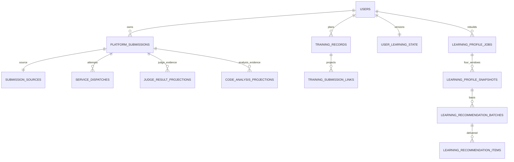

# V0.2 后端数据库与数据 owner 契约

契约发布号 `0.2.0`。PostgreSQL 延续存量 V0.11 + V0.12 结构；新增表单独扩展，不改 CF submissions 非空关系，不覆盖未知用户变更。HTTP 字段与完整对象 schema 见同目录《后端api文档》，部署权限见《V0.2-整体架构与联调说明》。本文最后给足旧30表字段和约束，不需要从历史文件反向拼表。

## 1. 权限、类型与关系原则

`backend` 是逻辑 owner/schema 归属名。存量表若在 public 可保留实际 schema，不要求重命名/搬迁；专属 backend 数据库角色唯一写旧表与下面新表。algorithm/judge 使用独立 schema/角色，仅 owner 自己迁移。服务之间无跨 owner ORM、无跨 schema FK；平台题/下游 task 为逻辑引用，通过已认证 API 校验。frontend 无数据库连接。

| owner | 主数据 | backend保存方式 |
|---|---|---|
| backend | 用户/角色/CF/团队/隐私/报告/通知、Submission/源码、训练、业务画像、推荐交付与可靠分发 | 业务主表，唯一写入 |
| judge-problem-service | 平台题目录、题包版本/测试/许可、导入、原始judge执行结果 | 只读缓存与不可修改结果投影，sourceOwner/sourceId/revision追溯 |
| algorithm | 静态工具任务/原报告/复現工件、profile执行工件 | 只读分析投影，业务学习画像仍backend主表 |

全部新表字段默认 NOT NULL；表中 `?` 表示可空，其余不允许 null。PK 隐含非空/唯一，所有 FK ON DELETE/UPDATE RESTRICT，软结束保护历史。Id字段 PostgreSQL bigint CHECK>0，对外十进制 string；计数 version bigint>0（目录未就绪可0）。UUID 作 UUID；Instant用timestamptz UTC；JSON对象/数组检查jsonb_typeof并应用层校验深层完整schema；numeric对外转有限number。新状态用varchar+CHECK，非PG原生ENUM。time_ms毫秒、memory_bytes字节、安全整数≤9007199254740991；所有计数≥0，score 0..1/能力score 0..100。created_at默认now()，updated_at每次有效变更更新；SHA256为64位小写hex。所有未被PK/UNIQUE左前缀覆盖的FK补B-tree。

新题目身份 `(source,platform,problem_id)`：PLATFORM/startrack/Id、版本非空UUID；EXTERNAL/codeforces/Id、版本空。题版本不参与去重/训练唯一键。旧 CF problems ID不改。平台Submission使用旧 submissions 分配器：通过 `pg_get_serial_sequence`/现有migration确认真实序列名，platform_submissions.id默认同一分配序列，不猜名字、不重置序列或旧ID。两表不会生成同一submissionId；历史旧submissions.id保持原值。若旧系统不是单序列，迁移只向前推进分配器到两表最大已分配值之后并锁住新增，记录校验，不能修改已有行ID。

旧COACH完整性约束继续生效：在user_roles的COACH DELETE/UPDATE、roles.is_active禁用COACH以及团队owner用户禁用/软删除路径增加DEFERRABLE约束触发器或等价数据库保护。仍是ACTIVE/ARCHIVED团队OWNER时拒绝事务，映射409 COACH_OWNS_TEAM，必须先transfer/dissolve；不能只在teams写入时检查。系统COACH不自动获得其他团队OWNER权限。

## 2. 新核心关系



Judge题包/algorithm工件通过sourceOwner/sourceId API关联，图中无跨owner FK。

## 3. platform_submissions（本站Submission主数据）

| 字段 | 类型 | PK/FK/约束 | 用途 |
|---|---|---|---|
| id | bigint，共用旧分配序列 | PK >0 | 全backend唯一submissionId |
| user_id | bigint | FK users.id | 本人归属 |
| platform_problem_id | bigint | >0，逻辑judge引用 | startrack题目ID，不FK CF problems |
| problem_version_id | uuid | 非空逻辑judge版本 | 本次冻结版本 |
| problem_snapshot | jsonb object | 完整ProblemSummary，身份与列一致 | 提交时公开题目元数据 |
| language_id | varchar(32) | 来源真实capability | cpp17等平台语言模板ID |
| source_sha256 | char(64) | SHA-256 | 源码一致性 |
| judge_status | varchar(24) | JudgeStatus | QUEUED/DISPATCHING/RUNNING/COMPLETED/FAILED/CANCELLED |
| judge_task_id | uuid? | 当前judge dispatch返回的sourceId | 尚未接收可空 |
| judge_revision | integer | >=0，默认0 | 当前任务最新可见revision |
| judge_error | jsonb object? | TaskError | 本地拒绝/派发故障或远程error，成功/在途null |
| judge_result_projection_id | uuid? | FK judge_result_projections.id，延迟 | 当前判题投影引用 |
| analysis_status | varchar(24) | AnalysisStatus | NOT_REQUESTED/QUEUED/RUNNING/SUCCEEDED/PARTIAL/FAILED/SKIPPED |
| analysis_id | uuid? | 当前analysis attempt的sourceId | 新重试身份，与最近可用证据分开 |
| analysis_revision | integer | >=0，默认0 | 当前尝试task内revision |
| analysis_error | jsonb object? | TaskError | 当前分析状态错误 |
| current_analysis_projection_id | uuid? | FK code_analysis_projections.id，延迟 | 当前attempt结果，queued可空 |
| usable_analysis_id | uuid? | 最近SUCCEEDED/PARTIAL的sourceId | profile特征依据，可不同于analysis_id |
| usable_analysis_revision | integer? | >=1，和usable ID同时可空 | 可用事实revision |
| usable_analysis_projection_id | uuid? | FK code_analysis_projections.id，延迟 | 最近可用不可变结果 |
| training_record_id | uuid | FK training_records.id | 该用户同题训练 |
| submitted_at | timestamptz | 接收时间不可改 | 平台训练事件时间 |
| created_at | timestamptz | 默认now | 入库时间 |
| updated_at | timestamptz | 有效状态/结果更新 | 页面刷新 |

COMPLETED必须任务已接收且有真实AC/WA/TLE/MLE/RE/CE/OLE结果；远程FAILED真实IE+error，本地明确拒绝/派发耗尽可以task_id=null、result=null、judge_error非空，不能造IE。CANCELLED结果可空，不计失败训练。非终态作为PENDING。公开SubmissionView增加judgeError，来源是此列；此表不保存外部CF account_id/external_submission_id。

分析指针必须关联同submission，sourceSha256一致。当前attempt以本Submission最新ANALYSIS dispatch的attempt_generation确定；下游ID尚空时也先比此代次再绑定sourceId/比较revision，旧尝试回调仅归档，不覆盖新attempt或usable。当前attempt状态与usable证据独立：PARTIAL重试QUEUED/FAILED/SKIPPED均不删除旧usable；新SUCCEEDED/PARTIAL原子替换usable并递增features版本。current_result不能借用其他analysisId结果。FK循环在创建投影后同事务回挂，使用DEFERRABLE约束/等价先空后写，不以跨服务表外键解决。

索引 `(user_id,submitted_at DESC,id DESC)`、`(user_id,platform_problem_id,submitted_at DESC)`、`(judge_task_id)`唯一非空、`(analysis_id)`唯一非空、`(judge_status,updated_at)`；结果引用验证投影source_id和submission一致。

## 4. submission_sources（私有源码owner）

| 字段 | 类型 | PK/FK/约束 | 用途 |
|---|---|---|---|
| submission_id | bigint | PK/FK platform_submissions.id | 本站源码 |
| source_code | text? | 与object_key二选一 | UTF8源码；不trim后保存 |
| object_key | text? | backend私有桶键，与source_code二选一 | 大对象存储可选 |
| source_sha256 | char(64) | 与Submission相同 | 原始UTF8字节校验 |
| byte_length | integer | 1..262144，非全空白 | 源码限制 |
| created_at | timestamptz | 不可改 | 接收时间 |

代码对象只backend账号可写读；judge/algorithm只接受受限临时任务副本，无主桶凭据。对象写成功后再关联DB，未引用对象后台回收；受理事务失败不能产生可读悬空源码。日志不存源码正文。源码终止保留策略须独立授权，当前设计不删除提交历史。团队privacy的detailedSubmissions不开放source接口。

## 5. service_dispatches（outbox与下游任务身份）

| 字段 | 类型 | PK/FK/约束 | 用途 |
|---|---|---|---|
| id | uuid | PK | durable派发项 |
| owner_service | varchar(32) | CHECK algorithm/judge-problem-service | 下游owner |
| operation | varchar(32) | CHECK JUDGE/ANALYSIS/PROFILE | 任务类型 |
| request_id | uuid | UNIQUE，不可改body | 下游幂等ID |
| submission_id | bigint? | FK platform_submissions.id | JUDGE/ANALYSIS主体 |
| learning_profile_job_id | uuid? | FK learning_profile_jobs.id | PROFILE主体 |
| attempt_generation | integer | >=1 | 每Submission任务尝试代次 |
| payload | jsonb object | 正式内部Request，无Cookie/用户秘密 | 网络retry冻结完整body |
| payload_hash | char(64) | JCS规范body hash | 同requestId同输入 |
| source_owner | varchar(32) | 等于owner_service | 证据owner |
| source_id | uuid? | 接收/早到callback绑定后不可改 | 下游task ID |
| source_revision | integer | >=0默认0 | 最新已接收任务版本 |
| source_status | varchar(24)? | 对应Task状态 | 轮询恢复 |
| status | varchar(24) | PENDING/SENDING/ACKNOWLEDGED/TERMINAL/FAILED | 派发状态，不等judge verdict |
| attempts | integer | 0..3 | 创建派发尝试，不计正常轮询 |
| next_attempt_at | timestamptz | 延迟重试 | outbox调度 |
| lease_owner | uuid? | 与租约成对 | stale worker fencing |
| lease_expires_at | timestamptz? | 与租约成对 | 崩溃恢复 |
| error | jsonb object? | TaskError | 拒绝/网络故障 |
| last_polled_at | timestamptz? | 对账时间 | 防漏回传 |
| reconciliation_required | boolean | 默认false | 接收结果不确定的本地FAILED仍需按原request_id查by-request；明确拒绝false |
| created_at | timestamptz | 不变 | 派发创建 |
| updated_at | timestamptz | 有效变更 | 重试/状态 |
| finished_at | timestamptz? | 终态非空 | 审计 |

CHECK只有正确主体：JUDGE/ANALYSIS需submission且profile_job空；PROFILE相反。UNIQUE(submission_id,operation,attempt_generation)，UNIQUE(owner_service,source_id)非空。先持久化requestId再网络，早到callback按requestId匹配并填sourceId，未知才404。POST超时先by-request，同body同requestId恢复，绝不自动生成新judge task。有限派发耗尽本地FAILED并记录可重试错误；已有远程task继续轮询。callback真实迟到可通过原记录核验恢复，不能错误重复创建用户Submission。终态拒绝4xx没有源task不得造judge result。索引 `(status,next_attempt_at)`、`(owner_service,source_status,last_polled_at)`、`(lease_expires_at) WHERE status='SENDING'`。

对接收结果不确定的网络故障，派发3次耗尽仅结束当前派发尝试：Submission可本地FAILED显示可恢复judgeError，dispatch.reconciliation_required=true，仍每30秒by-request对账且保留回调入口。查到原requestId的task后原子绑定sourceId、清除本地dispatch错误，并同步该真实task状态（可由本地FAILED转RUNNING/COMPLETED/远程FAILED）；这是接收不确定状态恢复，不是修改已完成JudgeTask事实。明确4xx拒绝设置reconciliation_required=false，不能复活。不存在新Submission或第二个judge requestId；恢复后按有效训练事实推进版本。分析旧attempt与已终结profile的迟到事件只归档，不替换新的当前attempt/已发布新画像。

网络retry保持payload；DATA_CHANGED重新计算需终结旧profile job，另建新job+requestId+冻结payload，不修改原requestId。事件提交、投影、后续分析/画像dispatch同事务。lease每30秒续180秒，仅lease持有者写派发状态；业务投影由callback reducer按task身份与revision更新。

## 6. service_event_inbox（幂等事件）

| 字段 | 类型 | PK/FK/约束 | 用途 |
|---|---|---|---|
| event_id | uuid | PK | eventId去重 |
| source_owner | varchar(32) | algorithm/judge-problem-service | 认证caller |
| event_type | varchar(32) | 三种公共eventType | 分流 |
| request_id | uuid | FK service_dispatches.request_id | 必须已知请求 |
| aggregate_id | uuid | 对应source_id | 下游任务 |
| revision | integer | >=1 | task内单调 |
| payload_hash | char(64) | 稳定完整payload hash | 冲突识别 |
| payload | jsonb object | CallbackEvent.payload | 受限审计快照 |
| occurred_at | timestamptz | 源时间，不排序依据 | 回调时间 |
| received_at | timestamptz | 后端时间 | 审计 |
| disposition | varchar(16) | APPLIED/DUPLICATE/STALE | reducer处理 |

sourceOwner/eventType/request主体必须一致；使用部分UNIQUE(source_owner,aggregate_id,revision) WHERE disposition IN (APPLIED,STALE)保存每个源revision首见canonical事实；其后同hash另记DUPLICATE行且仅受event_id唯一键，不触发部分唯一约束，防同revision不同hash，event_id相同不同内容也冲突409。poll生成内部去重事件同样走reducer。重复/旧revision200 ack，不递增业务版本、不重复新增训练/profile任务。索引(request_id)、(source_owner,aggregate_id,revision DESC)。

## 7. judge_result_projections 与 code_analysis_projections（只读证据副本）

共同字段：

| 字段 | 类型 | PK/FK/约束 | 用途 |
|---|---|---|---|
| id | uuid | PK | backend投影ID |
| submission_id | bigint | FK platform_submissions.id | 本站Submission |
| source_owner | varchar(32) | judge表固定judge-problem-service；analysis表固定algorithm | 原始owner |
| source_id | uuid | 逻辑JudgeTask/AnalysisJob ID | 源结果追溯 |
| revision | integer | >=1 | 源任务revision |
| request_id | uuid | FK service_dispatches.request_id | 原请求 |
| source_sha256 | char(64) | 与Submission一致 | 防代码/任务串线 |
| payload_hash | char(64) | 完整对象canonical hash | 同revision不同结果拒绝 |
| result | jsonb object | 完整JudgeResult或StaticAnalysisResult | 不可修改结果副本 |
| observed_at | timestamptz | backend接收 | 证据时间 |

judge表另 `status varchar(24)` 为COMPLETED/FAILED，result中的 verdict 与 status一致；analysis表另 `status varchar(24)` 只SUCCEEDED/PARTIAL，`toolchain_version varchar(40)`、`result_hash char(64)`；schemaVersion=0.2.0，tools/metrics/findings完整校验。两表UNIQUE(source_owner,source_id,revision)，(id,submission_id)复合唯一供指针外键。索引(submission_id,observed_at DESC)、request_id。只追加、无修改原始事实API；不对外泄露下游原始报告对象路径、隐藏测试/stdout/stderr。判题compileLog≤16384 UTF8bytes仅本人/Admin且脱敏；资源max单测试CPUms/peakbytes，未运行null。分析WARNING/ERROR是静态发现不是已验证程序Bug。

## 8. training_records 与 training_submission_links

| training_records字段 | 类型 | PK/FK/约束 | 用途 |
|---|---|---|---|
| id | uuid | PK | trainingRecordId |
| user_id | bigint | FK users.id | 本人 |
| source | varchar(16) | PLATFORM/EXTERNAL | 题目来源 |
| platform | varchar(32) | startrack/codeforces | 与source组合校验 |
| problem_id | bigint | >0；外部逻辑关联旧problems.id | 题目身份 |
| problem_version_id | uuid? | PLATFORM非空、EXTERNAL空 | 当前所选/最后提交版本 |
| problem_snapshot | jsonb object | ProblemSummary，与身份一致 | 最近可公开题元数据 |
| status | varchar(16) | PLANNED/IN_PROGRESS/COMPLETED | 由提交事实投影 |
| recommendation_batch_id | uuid? | FK learning_recommendation_batches.id，延迟 | 首次归因冻结，本人且批次含题 |
| first_submitted_at | timestamptz? | 无提交null | 历史首次尝试 |
| last_submitted_at | timestamptz? | 无提交null | 历史末次尝试 |
| attempt_count | integer | >=0默认0 | 提交事件数，CF跨账号去重 |
| accepted_submission_count | integer | 0..attempt_count | 有效AC次数 |
| last_submission_id | bigint? | 跨backend两Submission表逻辑引用 | 内部全局submission ID |
| completed_at | timestamptz? | 有效首AC，否则null | 完成事实 |
| created_at | timestamptz | 默认now | 计划/自动建记录 |
| updated_at | timestamptz | 有效变更 | 列表排序 |

UNIQUE(user_id,source,platform,problem_id)。PLANNED无实际提交；IN_PROGRESS有提交且AC=0；COMPLETED AC>0，首次有效AC时间非空。CF外链点击只计划，实际同步才完成；旧已解绑历史保留但不进入当前综合画像源集。重评可使状态重新IN_PROGRESS，重算有效事实，不能把曾AC永久当当前AC。lastSubmissionId引用内部记录并验证同owner，外部eventKey用CF原ID，不混淆。索引(user_id,updated_at DESC,id DESC)、(user_id,source,status,last_submitted_at DESC)。from/to按last_submitted_at，[from,to)，有界筛选不匹配null。

| training_submission_links字段 | 类型 | PK/FK/约束 | 用途 |
|---|---|---|---|
| id | bigint identity | PK | linkID |
| training_record_id | uuid | FK training_records.id | 目标 |
| event_key | text | startrack:submissionId/codeforces:externalSubmissionId | CF跨账号去重键 |
| source | varchar(16) | PLATFORM/EXTERNAL | 来源 |
| submission_id | bigint | 逻辑跨两主表ID | 平台或CF代表记录，取最小内部ID |
| account_id | bigint? | FK oj_accounts.id，外部非空平台空 | CF来源代表账号 |
| verdict | varchar(32) | CHECK旧Verdict全枚举；IE/取消/本地拒绝存OTHER且is_ability_evidence=false | 当前规范训练判定 |
| judge_verdict | varchar(8)? | 新JudgeVerdict仅平台可有 | 原始OLE/IE保留 |
| is_ability_evidence | boolean | IE/取消/本地拒绝=false | 历史与画像输入分开 |
| submitted_at | timestamptz | 原提交时间 | 窗口 |
| updated_at | timestamptz | 同步/重评更新 | 去重投影 |

UNIQUE(training_record_id,event_key)。此为训练业务投影，不替代两主Submission表；CF重复事件冲突导致USER_SOURCE_CONFLICT，不猜选某判定；合法同CF事件只一link。本表用于计划归因/历史计数，构造新画像以当前未解绑CF主记录和平台主表验证为准。平台IE仍有提交历史但不作为画像失败。索引(submission_id)、(account_id)、(training_record_id,submitted_at)。

## 9. user_learning_state、platform_catalog_state、external_catalog_version_history

| user_learning_state字段 | 类型 | PK/FK/约束 | 用途 |
|---|---|---|---|
| user_id | bigint | PK/FK users.id | 用户版本owner |
| platform_training_version | bigint | >0默认1 | Submission受理/有效judge/训练变更版本 |
| analysis_features_version | bigint | >0默认1 | 最近可用分析事实集合版本 |
| updated_at | timestamptz | 有效变更 | 源审计 |

重复callback不推进。新Submission影响PENDING集合所以受理事务推进training版本；有效judge/训练变更只每逻辑变更推进一次。analysis重试QUEUED/失败不改features；新SUCCEEDED/PARTIAL替换usable引用才递增。注册创建state，历史用户回填1。

| platform_catalog_state字段 | 类型 | PK/FK/约束 | 用途 |
|---|---|---|---|
| singleton_id | smallint | PK CHECK=1 | backend目录版本registry |
| platform_catalog_version | bigint | >=0，未完整拉取0 | 最近完整judge目录版本 |
| platform_snapshot_id | uuid? | 下游逻辑目录快照 | 读完整后原子切换 |
| platform_fetched_at | timestamptz? | 完整拉取时间 | 缓存寿命/恢复 |
| external_catalog_version | bigint | >=0，初始未建立0 | 新综合指纹用单调Id |
| external_change_sync_job_id | uuid? | FK sync_jobs.id | 旧真正变更CF目录的成功job |
| updated_at | timestamptz | 有效版本变更 | registry审计 |

| external_catalog_version_history字段 | 类型 | PK/FK/约束 | 用途 |
|---|---|---|---|
| version | bigint | PK >0 | 新综合目录版本 |
| sync_job_id | uuid? | UNIQUE/FK sync_jobs.id | UUID→新Id版本的映射，不硬转换 |
| is_baseline | boolean | 仅初始化锚点true | 存量目录导入兼容 |
| created_at | timestamptz | 不可改 | 推进时间 |

存量目录有内容时创建baseline version=1，sync_job_id可指最后实际变更job，无法可靠确认时null并记录baseline，之后每次实际改变目录的成功PROBLEM_CATALOG job推进一次version且插映射；0变化不推进。空目录未同步为0。catalog先完整抓取/解析为暂存数据，再在一个短事务内提交CF目录变更、job成功、registry与history；失败不修改公开CF目录，不能先提交一部分目录却不推进版本。旧V0.12 sourceFingerprint保留原sync job UUID实现，新learning指纹才引用此计数。external目录版本和platform版本不可混为同一来源序列。

## 10. platform_problem_cache（judge公开候选只读缓存）

| 字段 | 类型 | PK/FK/约束 | 用途 |
|---|---|---|---|
| catalog_version | bigint | PK组合，>0 | 完整目录版本 |
| platform_problem_id | bigint | PK组合，>0 | 逻辑judge题ID |
| problem_version_id | uuid | 当前/墓碑公开版本 | 不改题包事实 |
| status | varchar(16) | PUBLISHED/WITHDRAWN | 撤题墓碑 |
| summary | jsonb object | ProblemSummary，身份一致 | 算法候选最小字段 |
| source_owner | varchar(32) | 固定judge-problem-service | 只读来源 |
| source_id | bigint | 等于platform_problem_id | 溯源ID |
| fetched_at | timestamptz | 完整镜像时间 | 读取审计 |

PK(catalog_version,platform_problem_id)。后端只按完整目录snapshot staged写、全部成功后在同事务切platform_catalog_state；过期cursor重拉。不保存测试/题包/参考代码，管理员不编辑本表。推荐取state所指版本PUBLISHED；历史Submission/推荐独立完整快照，不靠当前cache补旧字段。索引(catalog_version,status)、GIN((summary->'tags'))；缓存可回收无历史引用版本，不影响主目录。

## 11. learning_profile_jobs（backend业务重建任务）

| 字段 | 类型 | PK/FK/约束 | 用途 |
|---|---|---|---|
| id | uuid | PK | 公开jobId |
| user_id | bigint | FK users.id | 用户主体 |
| status | varchar(16) | QUEUED/RUNNING/SUCCEEDED/FAILED | 公开ProfileJobStatus |
| source_fingerprint | char(64) | 冻结前也明确当前版本hash | 完整版本集合 |
| request_id | uuid | UNIQUE | 本次下游幂等输入ID |
| profile_job_id | uuid? | 当前下游sourceId | 算法ProfileJob |
| source_revision | integer | >=0默认0 | 下游revision |
| algorithm_version | varchar(40) | learning-profile-v0.2.1 | 公式 |
| mapping_version | varchar(32) | mapping-v0.11.1 | 六维映射 |
| data_cutoff_at | timestamptz? | 冻结输入时非空 | 统计时间边界 |
| input_payload | jsonb object? | 完整ProfileJobRequest，≤32MiB | 重试复現，无真名/邮箱 |
| error | jsonb object? | TaskError | 失败原因 |
| requested_by_user_id | bigint? | FK users.id | SYSTEM可空 |
| created_at | timestamptz | 不可改 | 公开createdAt |
| updated_at | timestamptz | 有效变更 | 公开updatedAt |
| finished_at | timestamptz? | 终态必有 | 结束 |

部分UNIQUE(user_id) WHERE status IN(QUEUED,RUNNING)，合并同用户在途；不对sourceFingerprint建立永久唯一！同fingerprint超过24h/手动新操作允许新job、新requestId和新cutoff。Idempotency-Key重放原job与在途合并是两种机制；不同用户不能互相合并。DATA_CHANGED旧job FAILED/error.retryable=true，scheduler新建job/新requestId重冻结，不能改旧requestId的payload。snapshot四窗口写入与job SUCCEEDED一个事务；非法/部分结果不得落单窗口。源未准备USER_SOURCE_NOT_READY保留旧快照。索引(user_id,created_at DESC)、(status,created_at)、profile_job_id唯一非空。

## 12. learning_profile_snapshots（业务学习画像主数据）

| 字段 | 类型 | PK/FK/约束 | 用途 |
|---|---|---|---|
| id | uuid | PK | snapshotId |
| user_id | bigint | FK users.id | 用户画像owner |
| job_id | uuid | FK learning_profile_jobs.id | 同次四窗口 |
| profile_job_id | uuid | 逻辑algorithm计算工件 | 追溯，非主数据owner转移 |
| window_type | varchar(8) | 7D/30D/365D/ALL | 窗口 |
| period_start | timestamptz? | ALL空，其他非空 | [start,end) |
| period_end | timestamptz | 等于data_cutoff_at | 排除端点 |
| data_cutoff_at | timestamptz | 与job冻结一致 | 证据截止 |
| source_fingerprint | char(64) | 与job一致 | 源版本 |
| source_versions | jsonb object | 指纹原始规范对象，不公开真实用户 | 可重算版本 |
| algorithm_version | varchar(40) | learning-profile-v0.2.1 | 不混旧CF版本 |
| mapping_version | varchar(32) | mapping-v0.11.1 | 不变配置 |
| timezone | varchar(64) | Asia/Shanghai | 自然日 |
| analysis | jsonb object | 完整LearningAnalysisResult | summary/六维/stats/sources/codeQuality |
| created_at | timestamptz | 只追加 | 历史 |

UNIQUE(job_id,window_type)、UNIQUE(id,user_id)、UNIQUE(id,mapping_version)。每job四窗口全成，共同requestId/fingerprint/cutoff；应用validator或deferred constraint trigger检查齐全。analysis不是任意json：完整字段schema来自API；summary计数非负、submission=accepted+failed+pending、attempted≥solved、unsolved=attempted−solved、solved=rated+unrated；平台/外部source counts总和=submission，codeAnalysisCount=analyzedSubmissionCount≤platformSubmissionCount；六维恰好6个固定code/rank1..6，score0..100，weakest=rank1；difficultyStats按scale+value唯一、null只UNRATED；平均/最高/rated只CF_RATING，其他尺度计unrated保留本尺度桶；tagStats标签唯一、difficultyStats尺度桶唯一、activityStats日期唯一且升序等关系校验。sources.sourceAccountIds全未解绑源集（四窗口相同），评级取各CF非null最大。codeQuality来自usable分析，warning/error不能推定Bug。stale查询派生，不落库。

索引(user_id,window_type,data_cutoff_at DESC,created_at DESC,id DESC)、job_id。旧user_analysis_snapshots不合并、不覆盖；新快照不能自动经旧团队profile接口分享。summary/六维为训练能力，代码质量另轴，不修改旧六维含义。

## 13. learning_recommendation_batches 与 learning_recommendation_items

| batch字段 | 类型 | PK/FK/约束 | 用途 |
|---|---|---|---|
| id | uuid | PK | 实际交付batchId，backend生成 |
| user_id | bigint | FK users.id | 本人 |
| analysis_snapshot_id | uuid | FK learning_profile_snapshots.id，与user复合 | 最新可用ALL画像 |
| source | varchar(16) | ALL/PLATFORM/EXTERNAL | 来源筛选 |
| mode | varchar(16) | LEVEL/WEAKNESS/HYBRID | 旧枚举 |
| source_fingerprint | char(64) | 冻结源集 | 不变审计 |
| catalog_versions | jsonb object | {externalCatalogVersion:Id,platformCatalogVersion:Id} | 冻结候选目录 |
| requested_limit | integer | 1..50 | 归一默认10 |
| candidate_count | integer | >=result_count | 模式过滤后数量 |
| result_count | integer | 0..requested_limit | 空批合法 |
| algorithm_version | varchar(40) | learning-recommend-v0.2.1 | 新算法 |
| mapping_version | varchar(32) | mapping-v0.11.1 | 映射 |
| request_id | uuid | UNIQUE | 无业务副作用排序关联 |
| idempotency_key | uuid | UNIQUE(user_id,key) | 公开重放 |
| request_hash | char(64) | 归一source/mode/limit | 参数冲突 |
| generated_at | timestamptz | 只追加 | 交付时间 |

| item字段 | 类型 | PK/FK/约束 | 用途 |
|---|---|---|---|
| id | bigint identity | PK | 交付item |
| batch_id | uuid | FK learning_recommendation_batches.id | 批次 |
| source | varchar(16) | PLATFORM/EXTERNAL | 来源 |
| platform | varchar(32) | startrack/codeforces | 平台 |
| problem_id | bigint | >0，逻辑目录身份 | 不裸ID联结 |
| problem_version_id | uuid? | 平台非空外部空 | 冻结版本 |
| problem_snapshot | jsonb object | 完整ProblemSummary | 历史题名/URL/尺度/标签 |
| rank_position | integer | >=1 | 原算法排序 |
| score | numeric(8,6) | 0..1 | 跨来源可比归一分数 |
| reason_code | varchar(64) | 旧10种ReasonCode | 固定理由 |
| reason_text | varchar(512) | 冻结后端固定文案 | 无评级固定补充说明 |
| matched_dimension_code | varchar(32)? | 六维或null | LEVEL/null |
| created_at | timestamptz | 只追加 | 交付审计 |

UNIQUE(batch_id,source,platform,problem_id)、UNIQUE(batch_id,rank_position)，rank连续1..result_count，明细总数=batch.result_count，source组合与ProblemRef一致。batch FK(analysis_snapshot_id,user_id)确保同owner，画像必须ALL，落库前重核指纹/目录/入选可提交状态。snapshot与每item不可更新历史；solvedSinceGeneration、stale查询派生，不落库。不将本表/新平台题写入旧CF recommendation_items。索引(user_id,source,mode,generated_at DESC,id DESC)、item(batch_id,rank_position)、item(source,platform,problem_id)。

## 14. idempotency_records 与 problem_admin_operations

| idempotency字段 | 类型 | PK/FK/约束 | 用途 |
|---|---|---|---|
| id | uuid | PK | 记录 |
| user_id | bigint | FK users.id | 用户作用域 |
| operation | varchar(64) | 明确端点操作，不含用户可伪造标签 | Submission/分析retry/profile/recommend/training/admin |
| key | uuid | UNIQUE(user_id,operation,key) | Idempotency-Key |
| request_hash | char(64) | 规范补默认值payload hash | 同key同参数 |
| status | varchar(16) | IN_PROGRESS/COMMITTED/FAILED | 调用幂等 |
| result_type | varchar(32)? | SUBMISSION/ANALYSIS_ATTEMPT/PROFILE_JOB/RECOMMENDATION_BATCH/TRAINING_RECORD/ADMIN_OPERATION | 对象类型 |
| result_id | text? | 逻辑业务对象引用，按类型验证同user | Id或UUID不可一概转UUID |
| response_snapshot | jsonb object? | 首次成功响应data冻结 | 无源码，不存Cookie |
| created_at | timestamptz | 不变 | key时间 |
| updated_at | timestamptz | 有效变更 | 恢复 |

业务对象成功与COMMITTED同事务。永久保留成功key/对象关联，不因24h缓存过期重复提交；可清大response以对象重放。async结果可能后续状态变化，同key仍返回原任务身份的当前视图；同步推荐返回原冻结批次。失败未有对象允许同key同输入再次推进，不能换参数。

| problem_admin_operations字段 | 类型 | PK/FK/约束 | 用途 |
|---|---|---|---|
| id | uuid | PK | 管理代理业务记录 |
| admin_user_id | bigint | FK users.id | 操作者ADMIN |
| operation | varchar(24) | IMPORT/PUBLISH/WITHDRAW/METADATA_VERSION | ownerAPI代理 |
| request_id | uuid | UNIQUE | judge管理幂等请求 |
| request_payload | jsonb object | 内部管理DTO | 固定来源commit/路径/版本 |
| payload_hash | char(64) | 不可换输入 | 超时恢复 |
| problem_id | bigint? | 逻辑judge引用 | 非导入目标 |
| import_job_id | uuid? | 逻辑judge引用 | 导入任务 |
| status | varchar(16) | PENDING/ACCEPTED/SUCCEEDED/PARTIAL/FAILED | 代理状态 |
| response_projection | jsonb object? | ImportJob/ProblemDetail owner不可修改副本 | 管理查询恢复 |
| error | jsonb object? | TaskError | 原因 |
| created_at | timestamptz | 不变 | 管理审计 |
| updated_at | timestamptz | 有效变更 | 管理恢复 |

backend不保存平台题包主数据，不由此表编辑目录缓存。metadata-versions调用judge创建新UUID/DRAFT版本，publish后公开目录推进。管理员仍只调用backend。

## 15. 学习源冻结和迁移验收

指纹规范对象为JCS/RFC8785 `{contractVersion,algorithmVersion,mappingVersion,accounts:[按accountId数值排序的{accountId,dataVersion,bindStatus}],externalCatalogVersion,platformCatalogVersion,platformTrainingVersion,analysisFeaturesVersion}`；hash为64位hex；cutoff另存，不因同指纹限制再次计算。未就绪目录0；user版本1；CF源ACTIVE/INVALID但必须曾完整成功同步且当前无在途，INVALID可用旧数据但stale。所有输入≤32MiB，超限不截断。

依赖顺序：保留旧30表→version state/目录缓存→learning jobs/snapshots→recommendation→training→platform_submissions/source→dispatch/inbox/投影→幂等/管理→deferred引用与索引；循环引用先建表后补FK。Migration只前向增加，root用户原文件/历史修改不覆盖。schema初始化/角色grant独立于HTTP启动，下游依赖不可达仍可认证/读历史。

验收必须覆盖：旧Session/多CF/团队隐私回归；共享Submission分配器新旧ID不冲突；跨owner写权限拒绝；submit受理事务+outbox重启恢复；callback先于POST响应；重复/乱序/同revision冲突；已接受judge后撤题仍原版本执行；明确4xx本地FAILED无伪IE；IE/取消不进失败能力；PARTIAL重试旧usable特征与fingerprint一致；同指纹24h重建可新job；DATA_CHANGED新requestId；目录全页原子切换/撤题；CF团队event去重与冲突；四窗口全成；新平台/外部推荐同身份排AC且空批合法；源码PRIVATE不受团队共享授权。

## 16. 审核保留的旧30表完整字段与约束

以下按原V0.11/V0.12定义保留。后端独占owner。旧字段保持原含义，旧画像CF-only，旧表不因新增owner而迁移给algorithm/judge。旧原生API的bigint字符串、nullable、Session等保持。仅保留表、类型、关系、约束、索引与业务用途，删去旧重复算法公式/Compose细节。

## 1. users

| 字段 | PostgreSQL 类型 | 主键/外键 | 约束 | 可空 | 用途 |
| ----------------------- | --------------- | ------------ | ------------------------------------------------- | ---- | ------------------------------------ |
| `id` | bigint identity | **PK** | 主键 | 否 | 内部用户 ID，不直接长期暴露给前端 |
| `public_id` | uuid | 非 PK/FK | UNIQUE | 否 | 对外稳定用户 ID |
| `username` | varchar(64) | 非 PK/FK | | 否 | 用户展示用户名 |
| `username_normalized` | varchar(64) | 非 PK/FK | UNIQUE | 否 | 标准化用户名，用于登录/唯一判断 |
| `email` | varchar(320) | 非 PK/FK | | 否 | 当前邮箱 |
| `email_normalized` | varchar(320) | 非 PK/FK | UNIQUE | 否 | 标准化邮箱 |
| `password_hash` | varchar(255) | 非 PK/FK | | 否 | 密码哈希，禁止明文 |
| `display_name` | varchar(64) | 非 PK/FK | | 是 | 昵称 |
| `avatar_url` | text | 非 PK/FK | | 是 | 头像 |
| `account_status` | varchar(24) | 非 PK/FK | CHECK IN ('ACTIVE','LOCKED','DISABLED','DELETED') | 否 | `ACTIVE/LOCKED/DISABLED/DELETED` |
| `email_verified_at` | timestamptz | 非 PK/FK | | 是 | 邮箱验证时间 |
| `last_login_at` | timestamptz | 非 PK/FK | 冗余字段 | 是 | 最近登录时间 |
| `last_active_at` | timestamptz | 非 PK/FK | 冗余字段 | 是 | 最近活跃时间 |
| `locale` | varchar(16) | 非 PK/FK | DEFAULT`zh-CN` | 否 | 国际化预留 |
| `timezone` | varchar(64) | 非 PK/FK | DEFAULT`Asia/Shanghai` | 否 | 页面显示时区；分析固定 Asia/Shanghai |
| `created_at` | timestamptz | 非 PK/FK | | 否 | 创建时间 |
| `updated_at` | timestamptz | 非 PK/FK | | 否 | 更新时间 |
| `deleted_at` | timestamptz | 非 PK/FK | | 是 | 软删除时间 |

UNIQUE(public_id)、UNIQUE(username_normalized)、UNIQUE(email_normalized) 包括软删除记录；CHECK normalized=lower(btrim(原值))。CHECK (account_status='DELETED')=(deleted_at IS NOT NULL)。用户删除为软删除并事务撤销会话、结束有效绑定；不级联删除历史。password_hash 使用 Argon2id 等自适应密码哈希。primaryRole 不落库：按 ADMIN、COACH、STUDENT 优先级在有效 roles 中选择，注册默认 STUDENT。


## 2. roles

| 字段 | PostgreSQL 类型 | 主键/外键 | 约束 | 可空 | 用途 |
| --------------- | --------------- | ------------ | ------ | ---- | ----------------------- |
| `id` | smallint | **PK** | | 否 | 角色 ID |
| `code` | varchar(32) | 非 PK/FK | UNIQUE | 否 | `STUDENT/COACH/ADMIN` |
| `name` | varchar(64) | 非 PK/FK | | 否 | 中文名称 |
| `description` | text | 非 PK/FK | | 是 | 说明 |
| `is_active` | boolean | 非 PK/FK | | 否 | 是否可分配 |
| `created_at` | timestamptz | 非 PK/FK | | 否 | 创建时间 |
| `updated_at` | timestamptz | 非 PK/FK | | 否 | 更新时间 |

UNIQUE(code)，种子 STUDENT/COACH/ADMIN；GUEST 不落库。V0.11 只开放 STUDENT 业务，保留多角色模型。


## 3. user_roles

| 字段 | PostgreSQL 类型 | 主键/外键 | 约束 | 可空 | 用途 |
| -------------- | --------------- | ----------------------------- | ---- | ---- | ------------------------ |
| `user_id` | bigint | **PK + FK → users.id** | | 否 | 用户 |
| `role_id` | smallint | **PK + FK → roles.id** | | 否 | 角色 |
| `granted_at` | timestamptz | 非 PK/FK | | 否 | 授权时间 |
| `granted_by` | bigint | **FK → users.id** | | 是 | 授权者；系统自动授权可空 |

PRIMARY KEY(user_id,role_id)，三个 FK 均 ON DELETE RESTRICT。权限读取 JOIN roles.is_active。赋权事务校验角色可用；至少保留一个有效角色。反向索引(role_id,user_id)。


## 4. auth_sessions

| 字段 | PostgreSQL 类型 | 主键/外键 | 约束 | 可空 | 用途 |
| ----------------- | --------------- | ------------------------ | ------ | ---- | ------------------------------------------------------------ |
| `id` | uuid | **PK** | | 否 | Session ID |
| `user_id` | bigint | **FK → users.id** | | 否 | 用户 |
| `user_agent` | text | 非 PK/FK | | 是 | 客户端信息 |
| `ip_hash` | varchar(128) | 非 PK/FK | | 是 | 可选，只存 IP 哈希 |
| `expires_at` | timestamptz | 非 PK/FK | | 否 | 会话过期时间 |
| `last_seen_at` | timestamptz | 非 PK/FK | | 是 | 最近使用时间 |
| `revoked_at` | timestamptz | 非 PK/FK | | 是 | 撤销时间 |
| `revoke_reason` | varchar(64) | 非 PK/FK | | 是 | `LOGOUT/PASSWORD_CHANGED/LOGOUT_ALL/ADMIN` |
| `created_at` | timestamptz | 非 PK/FK | | 否 | 创建时间 |
| `token_hash` | text | 非 PK/FK | UNIQUE | 否 | 256-bit 随机 Session token 的 SHA-256；Cookie 原文只发客户端 |

UNIQUE(token_hash)；CHECK expires_at>created_at，revoked_at 为空或不早于 created_at。有效会话需 revoked_at IS NULL、expires_at>now()、用户 ACTIVE；每请求校验。不使用 JWT 黑名单或刷新 Token。索引(user_id,revoked_at,expires_at)、(expires_at)。


## 5. auth_verification_codes

| 字段 | PostgreSQL 类型 | 主键/外键 | 约束 | 可空 | 用途 |
| --------------------------- | --------------- | ------------------------ | -------------------------------------------------------------------- | ---- | ----------------------------------------------- |
| `id` | uuid | **PK** | | 否 | 验证记录 ID |
| `user_id` | bigint | **FK → users.id** | | 是 | 注册前用户不存在，因此可空 |
| `purpose` | varchar(32) | 非 PK/FK | CHECK IN (REGISTER,PASSWORD_RESET,EMAIL_CHANGE_OLD,EMAIL_CHANGE_NEW) | 否 | 验证目的 |
| `target_email` | varchar(320) | 非 PK/FK | | 否 | 收件邮箱 |
| `target_email_normalized` | varchar(320) | 非 PK/FK | | 否 | 标准化邮箱 |
| `code_hash` | varchar(255) | 非 PK/FK | | 否 | 验证码 HMAC-SHA256，服务端 pepper；不得记录明文 |
| `attempt_count` | integer | 非 PK/FK | DEFAULT 0; CHECK 0..5 | 否 | 错误尝试次数 |
| `sent_at` | timestamptz | 非 PK/FK | | 否 | 发送时间 |
| `expires_at` | timestamptz | 非 PK/FK | | 否 | 过期时间 |
| `consumed_at` | timestamptz | 非 PK/FK | | 是 | 成功消费时间 |
| `created_at` | timestamptz | 非 PK/FK | | 否 | 创建时间 |

索引(target_email_normalized,sent_at DESC)、(expires_at)、(user_id)。CHECK expires_at>sent_at、consumed_at IS NULL OR consumed_at>=sent_at。purpose 与目标邮箱/用户绑定；REGISTER 的 user_id 为 NULL，找回不存在用户不创建可消费记录。换邮箱用途必须有 user_id；事务行锁核对并消费，错误次数递增不能随业务回滚。按标准化邮箱获取 advisory transaction lock，检查跨用途最近 sent_at≥60 秒，防并发绕过限频。图形 challenge 使用后端单实例 TTL 缓存（不把答案放客户端），重启失效；无需 Redis。


## 6. oj_accounts

| 字段 | PostgreSQL 类型 | 主键/外键 | 约束 | 可空 | 用途 |
| -------------------------- | --------------- | ------------------------ | --------------------------------- | ---- | -------------------------------------------------------- |
| `id` | bigint identity | **PK** | | 否 | OJ 账号 ID |
| `user_id` | bigint | **FK → users.id** | | 否 | 本次绑定的永久所属用户；禁止 UPDATE 为其他用户 |
| `platform` | varchar(32) | 非 PK/FK | | 否 | V0.11=`codeforces` |
| `external_id` | varchar(128) | 非 PK/FK | | 否 | 当前 Codeforces handle |
| `external_id_normalized` | varchar(128) | 非 PK/FK | CHECK = lower(btrim(external_id)) | 否 | CF canonical handle 的标准化标识；不是 CF 数字用户 ID |
| `display_name` | varchar(128) | 非 PK/FK | | 否 | 平台展示名 |
| `bind_status` | varchar(24) | 非 PK/FK | CHECK IN (ACTIVE,INVALID,UNBOUND) | 否 | 有效绑定包括 ACTIVE/INVALID；UNBOUND 为已结束绑定 |
| `rating` | integer | 非 PK/FK | | 是 | 当前 rating；未定级可空 |
| `max_rating` | integer | 非 PK/FK | | 是 | 最高 rating |
| `rank_title` | varchar(64) | 非 PK/FK | | 是 | CF rank，不做 enum |
| `max_rank_title` | varchar(64) | 非 PK/FK | | 是 | CF maxRank |
| `contribution` | integer | 非 PK/FK | | 是 | contribution |
| `friend_of_count` | integer | 非 PK/FK | | 是 | friendOfCount |
| `first_name` | varchar(128) | 非 PK/FK | | 是 | 可选字段 |
| `last_name` | varchar(128) | 非 PK/FK | | 是 | 可选字段 |
| `country` | varchar(128) | 非 PK/FK | | 是 | 可选字段 |
| `city` | varchar(128) | 非 PK/FK | | 是 | 可选字段 |
| `organization` | varchar(256) | 非 PK/FK | | 是 | 可选字段 |
| `avatar_url` | text | 非 PK/FK | | 是 | avatar |
| `title_photo_url` | text | 非 PK/FK | | 是 | titlePhoto |
| `registered_at` | timestamptz | 非 PK/FK | | 是 | registrationTimeSeconds 转换 |
| `last_online_at` | timestamptz | 非 PK/FK | | 是 | lastOnlineTimeSeconds 转换 |
| `last_synced_at` | timestamptz | 非 PK/FK | 冗余字段 | 是 | 三个 CF 数据阶段均成功的时间；分析失败仍更新 |
| `last_sync_status` | varchar(24) | 非 PK/FK | 冗余字段 | 是 | 最近同步状态 |
| `last_sync_error_code` | varchar(64) | 非 PK/FK | 冗余字段 | 是 | 最近同步错误码 |
| `next_sync_at` | timestamptz | 非 PK/FK | 冗余字段 | 是 | 下一次定时同步计划 |
| `platform_profile_raw` | jsonb | 非 PK/FK | DEFAULT`{}` | 否 | user.info 未建模扩展属性；剔除 email/openId 等非业务隐私 |
| `created_at` | timestamptz | 非 PK/FK | | 否 | 创建时间 |
| `updated_at` | timestamptz | 非 PK/FK | | 否 | 更新时间 |
| `unbound_at` | timestamptz | 非 PK/FK | | 是 | 解绑时间 |
| `bound_at` | timestamptz | 非 PK/FK | | 否 | 本次绑定开始时间；API boundAt |
| `data_version` | bigint | 非 PK/FK | DEFAULT 1; CHECK >0 | 否 | 账号数据版本；API sourceDataVersion 序列化为字符串 |

一个 user_id 可以有任意多个不同 CF 绑定。有效占位与状态 CHECK、索引如下：

```sql
CREATE UNIQUE INDEX uq_oj_accounts_live_identity
ON oj_accounts(platform, external_id_normalized)
WHERE unbound_at IS NULL;
CREATE INDEX ix_oj_accounts_user ON oj_accounts(user_id, bound_at DESC, id DESC);
ALTER TABLE oj_accounts ADD CHECK
 ((bind_status IN ('ACTIVE','INVALID') AND unbound_at IS NULL)
  OR (bind_status='UNBOUND' AND unbound_at IS NOT NULL));
ALTER TABLE oj_accounts ADD CHECK (unbound_at IS NULL OR unbound_at >= bound_at);
```

不设置 user_id/platform 唯一限制。用户外键永不转移；软解绑释放有效身份唯一键，每次重绑新建记录。历史记录允许相同平台/handle。绑定并发依赖部分唯一索引裁决，不靠先查后插；查到有效记录后按 user_id 映射两种 409。INVALID 仍占位，网络错误不改变绑定状态。索引(next_sync_at) WHERE bind_status='ACTIVE'。last_sync_status 可空或为 JobStatus，和对应最新任务在同一事务更新。

data_version 从 1 开始；用户资料、提交、Rating 的任何实际变化都在事务内锁账号并递增，或合并一个数据阶段增一次；重复无变化 upsert 不递增。算法输入读取固定版本。题库属性变化通过新的 cutoff 重建分析；其历史值不回写旧快照。


## 7. problems

| 字段 | PostgreSQL 类型 | 主键/外键 | 约束 | 可空 | 用途 |
| -------------------------- | --------------- | ------------ | ------------- | ---- | ------------------------------------------------------------------- |
| `id` | bigint identity | **PK** | | 否 | 内部题目 ID |
| `platform` | varchar(32) | 非 PK/FK | | 否 | `codeforces` |
| `external_problem_key` | text | 非 PK/FK | | 否 | contestId:index；非 contest 题使用本文规定的系统键 |
| `contest_id` | integer | 非 PK/FK | | 是 | problem.contestId |
| `problem_index` | varchar(32) | 非 PK/FK | | 是 | problem.index |
| `title` | varchar(256) | 非 PK/FK | | 是 | problem.name |
| `problem_type` | varchar(32) | 非 PK/FK | | 是 | PROGRAMMING/QUESTION 等 |
| `difficulty` | integer | 非 PK/FK | | 是 | CF rating；缺失必须 NULL |
| `points` | numeric | 非 PK/FK | | 是 | problem.points 原始小数，不推导 rating |
| `solved_count` | integer | 非 PK/FK | | 是 | problemStatistics.solvedCount |
| `tags` | text[] | 非 PK/FK | DEFAULT`{}` | 否 | 原始 CF tags |
| `is_gym` | boolean | 非 PK/FK | 冗余字段 | 否 | 有 contestId 且 >=100000 时 true，否则 false；非 contest 题仍不推荐 |
| `catalog_source` | varchar(24) | 非 PK/FK | CHECK | 否 | `CATALOG/INFERRED` |
| `url` | text | 非 PK/FK | | 是 | Codeforces 原题地址 |
| `first_seen_at` | timestamptz | 非 PK/FK | | 否 | 首次发现 |
| `last_catalog_synced_at` | timestamptz | 非 PK/FK | | 是 | 最近题库刷新 |
| `raw_problem_extra` | jsonb | 非 PK/FK | DEFAULT`{}` | 否 | 只保存未建模扩展字段，不重复复制整条 JSON |
| `created_at` | timestamptz | 非 PK/FK | | 否 | 创建时间 |
| `updated_at` | timestamptz | 非 PK/FK | | 否 | 更新时间 |
| `problemset_name` | text | 非 PK/FK | | 是 | problem.problemsetName，缺失为 NULL |
| `is_available` | boolean | 非 PK/FK | DEFAULT true | 否 | 目录内有效且可用于推荐；不代表探测每个题页 HTTP |

UNIQUE(platform,external_problem_key)。contest_id/problem_index 可空用于防御性占位；合法普通题至少有 contestId+index。title/url/difficulty/points/solved_count 缺失保留 NULL；CHECK difficulty IS NULL OR difficulty>0，不将样本 800..3500 固化为数据库上限。solved_count 非负、tags 无 NULL 元素且去重，tag 是 text，非 ENUM。

普通和 Gym 键为 contestId:index，例如 2264:C，URL 分别为 https://codeforces.com/contest/2264/problem/C 和 https://codeforces.com/gym/105632/problem/A。不解析 index 为单字符。非 contest 题若有 problemsetName+index，内部键为 `set:<URL编码problemsetName>:<URL编码index>`；只有已验证 URL 才填 url。若二者均无法定位，内部键 `unknown-submission:<CF submission id>`，INFERRED、url=NULL、is_available=false，错误记为 SUBMISSION_PARSE_FAILED；它是本系统占位键，不是臆造的 CF 字段。后续确认真实身份时事务重挂 submission 并归并占位题，不产生空 problem_id。

索引(platform,difficulty)、GIN(tags)、(solved_count DESC)。CF 题库完整成功批次才将本轮缺失的 CATALOG 标 is_available=false；不删除、不影响 INFERRED。提交可先补建 INFERRED，题库后来收录则升级为 CATALOG。CATALOG 优先，submission payload 不清空/覆盖已同步题库的难度/tags/solved_count；INFERRED 只用可用字段补全。相同来源完整新记录显式 null/缺失可更新为 NULL，不用 COALESCE 永远保留过期值。


## 8. submissions

| 字段 | PostgreSQL 类型 | 主键/外键 | 约束 | 可空 | 用途 |
| ----------------------------- | --------------- | ------------------------------ | --------------------------------------------------------------- | ---- | ----------------------------------------------- |
| `id` | bigint identity | **PK** | | 否 | 内部 ID |
| `account_id` | bigint | **FK → oj_accounts.id** | | 否 | 所属 OJ 账号 |
| `problem_id` | bigint | **FK → problems.id** | | 否 | 对应题目，禁止 NULL |
| `platform` | varchar(32) | 非 PK/FK | | 否 | `codeforces` |
| `external_submission_id` | bigint | 非 PK/FK | | 否 | CF submission id |
| `contest_id` | integer | 非 PK/FK | | 是 | contestId |
| `relative_time_seconds` | bigint | 非 PK/FK | | 是 | 原值；允许 Integer.MAX_VALUE 哨兵 |
| `verdict_raw` | varchar(64) | 非 PK/FK | | 是 | CF 原始 verdict，缺失/null 允许 |
| `verdict_category` | varchar(32) | 非 PK/FK | CHECK 为公开 Verdict 集合 | 否 | 标准化判定；缺失/TESTING/SUBMITTED→PENDING |
| `language_raw` | text | 非 PK/FK | | 是 | programmingLanguage 自由文本，禁止封闭 ENUM |
| `language_family` | varchar(32) | 非 PK/FK | | 是 | CPP/JAVA/PYTHON/... |
| `testset` | varchar(32) | 非 PK/FK | | 是 | TESTS/PRETESTS/... |
| `passed_test_count` | integer | 非 PK/FK | | 是 | passedTestCount |
| `time_ms` | bigint | 非 PK/FK | CHECK >=0 | 是 | timeConsumedMillis，JSON number 安全整数 |
| `memory_bytes` | bigint | 非 PK/FK | CHECK >=0 | 是 | memoryConsumedBytes，字节；JSON number 安全整数 |
| `submission_points` | numeric(12,4) | 非 PK/FK | | 是 | submission points |
| `points_info` | jsonb | 非 PK/FK | | 是 | 原样 JSON 稀疏扩展，不假设一定为对象 |
| `participant_id` | bigint | 非 PK/FK | | 是 | author.participantId |
| `participant_type_raw` | varchar(32) | 非 PK/FK | | 是 | 原始 participantType |
| `participant_type_category` | varchar(32) | 非 PK/FK | CHECK IN (CONTESTANT,VIRTUAL,PRACTICE,OUT_OF_COMPETITION,OTHER) | 是 | MANAGER 等未知类型映射 OTHER，原值另存 |
| `ghost` | boolean | 非 PK/FK | | 是 | author.ghost |
| `author_start_at` | timestamptz | 非 PK/FK | | 是 | author.startTimeSeconds |
| `room` | integer | 非 PK/FK | | 是 | author.room |
| `team_id` | bigint | 非 PK/FK | | 是 | author.teamId |
| `team_name` | varchar(256) | 非 PK/FK | | 是 | author.teamName |
| `member_handles` | text[] | 非 PK/FK | DEFAULT`{}` | 否 | author.members[].handle |
| `submitted_at` | timestamptz | 非 PK/FK | | 否 | creationTimeSeconds 转换 |
| `raw_submission_extra` | jsonb | 非 PK/FK | DEFAULT`{}` | 否 | 未建模稀疏字段，不默认重复保存完整 payload |
| `created_at` | timestamptz | 非 PK/FK | | 否 | 入库时间 |
| `updated_at` | timestamptz | 非 PK/FK | | 否 | 判定重评/upsert 更新时间 |

UNIQUE(account_id,external_submission_id)，不是全平台提交唯一；同一团队提交可以出现在两个账号的公开历史，同一账号重复同步只能一条。同一绑定重试及分页重叠执行 upsert，可更新重评判定及资源消耗。problem_id 非空 FK，先建最小 INFERRED problem 再写提交，两者同事务。

索引(account_id,submitted_at DESC,id DESC)、(account_id,problem_id)、(problem_id,verdict_category)，部分索引(account_id,problem_id,submitted_at) WHERE verdict_category='ACCEPTED'。保存 author.members[].handle 数组，缺失可用 []，不以成员数量拆多条本账号提交；不根据 author 自行写其他 accountId。participant_id/team_id 是外部编号而不是 FK。relative_time_seconds 保留原值，包括 Integer.MAX_VALUE 哨兵，不当真实耗时。memory_bytes/time_ms 不做单位转换且在 [0,9007199254740991]；passed_test_count 非负可空；submission_points 与 problem.points 分开。

标准化：OK→ACCEPTED，TIME_LIMIT_EXCEEDED→TIME_LIMIT，MEMORY_LIMIT_EXCEEDED→MEMORY_LIMIT，COMPILATION_ERROR→COMPILE_ERROR，IDLENESS_LIMIT_EXCEEDED→IDLENESS_LIMIT；PARTIAL/WRONG_ANSWER/RUNTIME_ERROR/SKIPPED/CHALLENGED/PRESENTATION_ERROR 同名；缺失、null、TESTING、SUBMITTED→PENDING，其余→OTHER。OTHER 保留原值供排查。语言原文为自由文本，language_family 仅可选辅助分类，不影响统计。


## 9. rating_changes

| 字段 | PostgreSQL 类型 | 主键/外键 | 约束 | 可空 | 用途 |
| ----------------------- | --------------- | ------------------------------ | -------------------------------------------------- | ---- | ------------------------------------------- |
| `id` | bigint identity | **PK** | | 否 | 内部 ID |
| `account_id` | bigint | **FK → oj_accounts.id** | | 否 | OJ 账号 |
| `platform` | varchar(32) | 非 PK/FK | | 否 | `codeforces` |
| `external_contest_id` | integer | 非 PK/FK | | 否 | contestId |
| `contest_name` | varchar(256) | 非 PK/FK | | 否 | contestName |
| `contest_rank` | integer | 非 PK/FK | | 否 | rank |
| `old_rating` | integer | 非 PK/FK | | 否 | oldRating |
| `new_rating` | integer | 非 PK/FK | | 否 | newRating |
| `rating_delta` | integer | 非 PK/FK | GENERATED ALWAYS AS (new_rating-old_rating) STORED | 否 | 派生 rating 差，不接收客户端值 |
| `occurred_at` | timestamptz | 非 PK/FK | | 否 | ratingUpdateTimeSeconds |
| `created_at` | timestamptz | 非 PK/FK | | 否 | 入库时间 |
| `handle_raw` | text | 非 PK/FK | | 否 | user.rating.handle 原值；不用于转移账号归属 |
| `updated_at` | timestamptz | 非 PK/FK | | 否 | 同场比赛记录重新抓取修正时间 |

UNIQUE(account_id,external_contest_id)，索引(account_id,occurred_at DESC)。contest_rank>0，Rating 允许 0 或负数，不限制为题目难度范围。完整 user.rating=[] 合法；完整抓取成功后以本次完整集合校准当前账号比赛历史（移除被官方撤销的记录），不影响已保存分析快照。失败不删除历史。


## 10. sync_jobs

| 字段 | PostgreSQL 类型 | 主键/外键 | 约束 | 可空 | 用途 |
| ----------------------- | --------------- | ------------------------------ | ----------------------------------------------------- | ---- | ------------------------------------------------------------ |
| `id` | uuid | **PK** | | 否 | 同步任务 ID |
| `account_id` | bigint | **FK → oj_accounts.id** | | 是 | 账号同步有值；全题库同步为空 |
| `platform` | varchar(32) | 非 PK/FK | | 否 | 平台 |
| `scope` | varchar(32) | 非 PK/FK | CHECK IN (ACCOUNT_FULL,ANALYSIS_ONLY,PROBLEM_CATALOG) | 否 | 同步范围 |
| `trigger_type` | varchar(24) | 非 PK/FK | CHECK IN (MANUAL,SCHEDULED,SYSTEM) | 否 | `MANUAL/SCHEDULED/SYSTEM` |
| `status` | varchar(24) | 非 PK/FK | CHECK IN (QUEUED,RUNNING,SUCCESS,PARTIAL,FAILED) | 否 | 任务状态 |
| `stage` | varchar(32) | 非 PK/FK | CHECK 为 JobStage 集合 | 是 | 失败终态保持失败阶段，成功为 DONE |
| `items_fetched` | integer | 非 PK/FK | DEFAULT 0 | 否 | 拉取数 |
| `items_inserted` | integer | 非 PK/FK | DEFAULT 0 | 否 | 新增数 |
| `items_updated` | integer | 非 PK/FK | DEFAULT 0 | 否 | 更新数 |
| `requested_at` | timestamptz | 非 PK/FK | | 否 | 创建时间 |
| `started_at` | timestamptz | 非 PK/FK | | 是 | 开始时间 |
| `finished_at` | timestamptz | 非 PK/FK | | 是 | 结束时间 |
| `created_at` | timestamptz | 非 PK/FK | | 否 | 记录创建时间 |
| `errors` | jsonb | 非 PK/FK | DEFAULT '[]'; CHECK jsonb_typeof='array' | 否 | JobError[]，每项 stage/code/message/retryable |
| `completed_stages` | text[] | 非 PK/FK | DEFAULT '{}' | 否 | 已成功阶段，不重复；判定 PARTIAL 包含成功零行阶段 |
| `lease_owner` | uuid | 非 PK/FK | | 是 | worker 本次领取 token；防止失效 worker 回写 |
| `lease_expires_at` | timestamptz | 非 PK/FK | | 是 | RUNNING 租约到期；每 30 秒续 180 秒 |
| `attempt_count` | integer | 非 PK/FK | DEFAULT 0; CHECK >=0 | 否 | worker 领取次数 |
| `analysis_request_id` | uuid | 非 PK/FK | | 是 | 本次分析 HTTP requestId，冻结输入时生成 |
| `analysis_input` | jsonb | 非 PK/FK | | 是 | 冻结 AnalyzeRequest 供重启/网络重试复用；终态保留 7 天后清空 |

account_id 仅 PROBLEM_CATALOG 可 NULL；CHECK (scope='PROBLEM_CATALOG')=(account_id IS NULL)。所有计数非负；QUEUED 要求 started_at/finished_at/lease 为空；RUNNING 要求 started_at、lease_owner、lease_expires_at 非空且 finished_at 为空；终态要求 finished_at 非空且 lease 字段清空（排队后解绑可直接 FAILED、started_at 仍为空）。errors/analysis_input 禁止凭据。status=SUCCESS 要求 errors=[]；PARTIAL/FAILED 至少一个错误。

```sql
CREATE UNIQUE INDEX uq_sync_account_inflight ON sync_jobs(account_id)
WHERE account_id IS NOT NULL AND status IN ('QUEUED','RUNNING');
CREATE UNIQUE INDEX uq_sync_catalog_inflight ON sync_jobs(platform)
WHERE scope='PROBLEM_CATALOG' AND status IN ('QUEUED','RUNNING');
```

索引(status,requested_at)、(account_id,requested_at DESC)、(lease_expires_at) WHERE status='RUNNING'。只允许一项在途账号任务，含分析重建。后台 worker 使用 SELECT FOR UPDATE SKIP LOCKED 领取，短事务提交后执行网络访问，写入前核对 lease_owner。每阶段/每页独立提交，不能用跨所有阶段的大事务。


## 11. skill_dimensions

| 字段 | PostgreSQL 类型 | 主键/外键 | 约束 | 可空 | 用途 |
| ----------------- | --------------- | ------------ | ---- | ---- | ---------------------------------------------- |
| `id` | smallint | **PK** | | 否 | 维度 ID |
| `code` | varchar(32) | 非 PK/FK | | 否 | 维度稳定代码，UNIQUE(version,code) |
| `name` | varchar(64) | 非 PK/FK | | 否 | 展示名称 |
| `description` | text | 非 PK/FK | | 是 | 定义 |
| `display_order` | smallint | 非 PK/FK | | 否 | 雷达图顺序 |
| `is_active` | boolean | 非 PK/FK | | 否 | 版本是否提供给新计算；历史版本不可删除 |
| `version` | varchar(32) | 非 PK/FK | | 否 | 不可变配置版本 mapping-v0.11.1；同版本恰好六维 |
| `created_at` | timestamptz | 非 PK/FK | | 否 | 创建时间 |
| `updated_at` | timestamptz | 非 PK/FK | | 否 | 更新时间 |

UNIQUE(version,code)、UNIQUE(version,display_order)、UNIQUE(id,version)，CHECK display_order BETWEEN 1 AND 6。每版本必须恰好六行，Migration 中事务校验。配置发布后不可修改名称、顺序或删除；新版本插入新 ID。V0.11 仅 mapping-v0.11.1 有效；结果引用版本，不依赖查询时“当前激活维度”。


## 12. tag_skill_mappings

| 字段 | PostgreSQL 类型 | 主键/外键 | 约束 | 可空 | 用途 |
| ------------------- | --------------- | --------------------------------------- | ---------------- | ---- | ------------------------ |
| `id` | bigint identity | **PK** | | 否 | 映射 ID |
| `platform` | varchar(32) | 非 PK/FK | | 否 | `codeforces` |
| `tag` | varchar(128) | 非 PK/FK | | 否 | 原始 CF tag |
| `dimension_id` | smallint | **FK → skill_dimensions.id** | | 否 | 能力维度 |
| `weight` | numeric(6,4) | 非 PK/FK | CHECK >0 AND <=1 | 否 | 映射权重；当前全部为 1 |
| `mapping_version` | varchar(32) | 复合 FK → skill_dimensions(id,version) | | 否 | 必须等于对应维度 version |
| `is_active` | boolean | 非 PK/FK | | 否 | 是否启用 |
| `created_at` | timestamptz | 非 PK/FK | | 否 | 创建时间 |
| `updated_at` | timestamptz | 非 PK/FK | | 否 | 更新时间 |

UNIQUE(platform,tag,dimension_id,mapping_version)，复合 FK(dimension_id,mapping_version)→skill_dimensions(id,version) ON DELETE RESTRICT；CHECK weight>0 AND weight<=1。索引(dimension_id,mapping_version)。平台/tag 不用封闭 ENUM；新增映射必须新 mapping_version，不改旧版本内容。


## 13. analysis_snapshots

| 字段 | PostgreSQL 类型 | 主键/外键 | 约束 | 可空 | 用途 |
| ----------------------------- | --------------- | --------------------------------------------------------------------- | -------------------------- | ---- | ------------------------------------------------- |
| `id` | uuid | **PK** | | 否 | 快照 ID |
| `account_id` | bigint | **FK → oj_accounts.id** | | 否 | 分析的数据账号 |
| `window_type` | varchar(16) | 非 PK/FK | CHECK | 否 | `7D/30D/365D/ALL` |
| `window_start` | timestamptz | 非 PK/FK | | 是 | ALL 可空 |
| `window_end` | timestamptz | 非 PK/FK | | 否 | 窗口结束 |
| `data_cutoff_at` | timestamptz | 非 PK/FK | | 否 | 使用数据的截止时刻 |
| `attempted_problem_count` | integer | 非 PK/FK | | 否 | 去重尝试题数 |
| `solved_count` | integer | 非 PK/FK | | 否 | 去重 AC 题数 |
| `submission_count` | integer | 非 PK/FK | | 否 | 全部提交次数 |
| `accepted_submission_count` | integer | 非 PK/FK | | 否 | ACCEPTED 提交次数 |
| `failed_submission_count` | integer | 非 PK/FK | | 否 | 非 ACCEPTED 且非 PENDING 的提交数 |
| `rated_solved_count` | integer | 非 PK/FK | | 否 | 有 difficulty 的 AC 题数 |
| `unrated_solved_count` | integer | 非 PK/FK | | 否 | 无 difficulty 的 AC 题数 |
| `average_solved_difficulty` | numeric(10,2) | 非 PK/FK | | 是 | 已解有 rating 题平均难度 |
| `max_solved_difficulty` | integer | 非 PK/FK | | 是 | 已解最高难度 |
| `current_rating` | integer | 非 PK/FK | | 是 | 分析时当前 CF rating |
| `max_rating` | integer | 非 PK/FK | | 是 | 分析时 CF maxRating |
| `active_days` | integer | 非 PK/FK | | 否 | 窗口内有提交的自然日数 |
| `overall_score` | numeric(5,2) | 非 PK/FK | CHECK 0..100 | 否 | 算法综合评分；无数据为 0 |
| `weakest_dimension_id` | smallint | **FK → skill_dimensions.id** | | 否 | rank_order=1 的本版本维度 |
| `tag_stats` | jsonb | 非 PK/FK | CHECK jsonb_typeof='array' | 否 | TagStat[] |
| `difficulty_stats` | jsonb | 非 PK/FK | CHECK jsonb_typeof='array' | 否 | DifficultyStat[]，含 null 难度桶 |
| `activity_stats` | jsonb | 非 PK/FK | CHECK jsonb_typeof='array' | 否 | ActivityStat[]；仅活跃日，日 solved 为窗口首次 AC |
| `analysis_version` | varchar(32) | 非 PK/FK | | 否 | API algorithmVersion；profile-v0.11.1 |
| `created_at` | timestamptz | 非 PK/FK | | 否 | 创建时间 |
| `request_id` | uuid | 非 PK/FK | | 否 | AnalyzeRequest.requestId；幂等运行标识 |
| `source_data_version` | bigint | 非 PK/FK | CHECK >0 | 否 | 源账号数据版本 |
| `timezone` | text | 非 PK/FK | CHECK = 'Asia/Shanghai' | 否 | 分析自然日时区 |
| `mapping_version` | varchar(32) | 复合 FK → skill_dimensions(id,version)，与 weakest_dimension_id 配对 | | 否 | 不可变映射版本 |
| `unsolved_problem_count` | integer | 非 PK/FK | CHECK >=0 | 否 | attempted_problem_count-solved_count |
| `pending_submission_count` | integer | 非 PK/FK | CHECK >=0 | 否 | 等待判题提交数 |

UNIQUE(account_id,window_type,request_id)，UNIQUE(id,account_id)，UNIQUE(id,mapping_version)。window_type CHECK 为 7D/30D/365D/ALL；ALL 要求 window_start IS NULL，其余非空且 <window_end；window_end=data_cutoff_at。所有 count 非负；solved_count<=attempted_problem_count<=submission_count；unsolved=attempted−solved；submission=accepted+failed+pending；solved=rated+unrated。rated=0 时 average/max 均 NULL，rated>0 时均非空。

复合 FK(weakest_dimension_id,mapping_version)→skill_dimensions(id,version)。索引(account_id,window_type,data_cutoff_at DESC,created_at DESC,id DESC)。每个快照只插入成功完整结果，不保存失败半成品，不按日期覆盖同日历史。数组遵循 AnalysisResult 的 TagStat[]/DifficultyStat[]/ActivityStat[]；JSON 深层 schema 与求和由后端 validator 校验。stale 为查询派生值，不落库。


## 14. analysis_dimension_scores

| 字段 | PostgreSQL 类型 | 主键/外键 | 约束 | 可空 | 用途 |
| ----------------------------- | --------------- | ------------------------------------- | ----------- | ---- | ----------------------------------------- |
| `id` | bigint identity | **PK** | | 否 | 明细 ID |
| `snapshot_id` | uuid | **FK → analysis_snapshots.id** | | 否 | 快照 |
| `dimension_id` | smallint | **FK → skill_dimensions.id** | | 否 | 能力维度 |
| `score` | numeric(5,2) | 非 PK/FK | CHECK 0~100 | 否 | 分数 |
| `attempted_problem_count` | integer | 非 PK/FK | | 否 | 维度尝试题数 |
| `solved_count` | integer | 非 PK/FK | | 否 | 维度 AC 题数 |
| `submission_count` | integer | 非 PK/FK | | 否 | 相关提交数 |
| `average_solved_difficulty` | numeric(10,2) | 非 PK/FK | | 是 | 维度平均难度 |
| `rank_order` | smallint | 非 PK/FK | CHECK 1..6 | 否 | 1 最弱，按分数升序、displayOrder 平局排序 |
| `created_at` | timestamptz | 非 PK/FK | | 否 | 创建时间 |

UNIQUE(snapshot_id,dimension_id)、UNIQUE(snapshot_id,rank_order)。score CHECK 0..100，计数非负，solved<=attempted<=submission。后端事务校验 dimension_id 的 version 等于 snapshot.mapping_version，每个快照恰好六行，weakest_dimension_id 对应 rank_order=1。Migration 创建 DEFERRABLE INITIALLY DEFERRED constraint trigger，在快照及明细 INSERT/UPDATE/DELETE 的事务提交时检查六行、版本、rank 排列及 weakest 一致性；允许同一事务先写头再写六行。


## 15. recommendation_batches

| 字段 | PostgreSQL 类型 | 主键/外键 | 约束 | 可空 | 用途 |
| ------------------------ | --------------- | --------------------------------------------------------------------------------- | --------------- | ------------ | ----------------------------------------------------- |
| `id` | uuid | **PK** | | 否 | 推荐批次 ID |
| `account_id` | bigint | **FK → oj_accounts.id** | | 否 | 推荐对象 |
| `analysis_snapshot_id` | uuid | **FK → analysis_snapshots.id** | | **否** | 推荐所依据画像 |
| `mode` | varchar(24) | 非 PK/FK | CHECK | 否 | `HYBRID/LEVEL/WEAKNESS` |
| `target_rating` | integer | 非 PK/FK | CHECK 800..3500 | 否 | 推荐目标难度中心 |
| `target_dimension_id` | smallint | **FK → skill_dimensions.id** | | 是 | LEVEL 为 NULL，WEAKNESS/HYBRID 为画像最弱维度 |
| `algorithm_version` | varchar(32) | 非 PK/FK | | 否 | 推荐算法版本 |
| `candidate_count` | integer | 非 PK/FK | | 否 | 进入排序候选数 |
| `result_count` | integer | 非 PK/FK | | 否 | 返回数量 |
| `generated_at` | timestamptz | 非 PK/FK | | 否 | 生成时间 |
| `mapping_version` | varchar(32) | 复合 FK → analysis_snapshots(id,mapping_version) 及 skill_dimensions(id,version) | | 否 | 分别与 analysis_snapshot_id、target_dimension_id 配对 |
| `source_data_version` | bigint | 非 PK/FK | CHECK >0 | 否 | 候选读取与画像匹配的数据版本 |
| `data_cutoff_at` | timestamptz | 非 PK/FK | | 否 | 候选读取时间 |
| `request_id` | uuid | 非 PK/FK | | 否 | 内部算法 requestId |
| `idempotency_key` | uuid | 非 PK/FK | | 否 | 公开 Idempotency-Key |
| `request_hash` | char(64) | 非 PK/FK | | 否 | 规范化 mode/limit 请求体 SHA-256 |
| `requested_limit` | integer | 非 PK/FK | CHECK 1..50 | 否 | 用户请求数量 |

UNIQUE(account_id,idempotency_key)，复合 FK(analysis_snapshot_id,account_id)→analysis_snapshots(id,account_id)，复合 FK(analysis_snapshot_id,mapping_version)→analysis_snapshots(id,mapping_version)，可空复合 FK(target_dimension_id,mapping_version)→skill_dimensions(id,version)。目标维度 LEVEL 为 NULL，另两模式非空；模式 CHECK LEVEL/WEAKNESS/HYBRID。candidate_count>=result_count>=0；result_count<=requested_limit。快照必须 ALL、完整且有效由后端事务校验。

索引(account_id,mode,generated_at DESC,id DESC)。只保存成功批次，包括 0 项批次。Idempotency-Key 同请求重放，不再次写入；request_hash 为公共请求默认值归一后的 mode/limit 的 SHA-256，不含变化的候选/时间。


## 16. recommendation_items

| 字段 | PostgreSQL 类型 | 主键/外键 | 约束 | 可空 | 用途 |
| ---------------------------------- | --------------- | ----------------------------------------- | --------------------------- | ---- | ------------------------------------------ |
| `id` | bigint identity | **PK** | | 否 | 推荐明细 ID |
| `batch_id` | uuid | **FK → recommendation_batches.id** | | 否 | 所属批次 |
| `problem_id` | bigint | **FK → problems.id** | | 否 | 推荐题目 |
| `rank_position` | integer | 非 PK/FK | | 否 | 1 开始 |
| `score` | numeric(8,6) | 非 PK/FK | CHECK 0~1 | 否 | 推荐分数 |
| `difficulty_delta` | integer | 非 PK/FK | | 否 | problem.difficulty-target_rating |
| `matched_dimension_id` | smallint | **FK → skill_dimensions.id** | | 是 | 主要命中能力 |
| `reason_code` | varchar(64) | 非 PK/FK | | 否 | 固定原因码 |
| `reason_text` | varchar(256) | 非 PK/FK | | 否 | 后端按固定模板映射后的文本 |
| `difficulty_at_recommendation` | integer | 非 PK/FK | 冗余快照字段 | 否 | 推荐生成时难度；候选必须有值 |
| `solved_count_at_recommendation` | integer | 非 PK/FK | 冗余快照字段 | 是 | 推荐当时 CF solvedCount |
| `tags_at_recommendation` | text[] | 非 PK/FK | DEFAULT`{}` | 否 | 推荐当时 tags |
| `created_at` | timestamptz | 非 PK/FK | | 否 | 创建时间 |
| `problem_snapshot` | jsonb | 非 PK/FK | CHECK jsonb_typeof='object' | 否 | 完整 ProblemDto 冻结对象；历史展示以它为准 |

UNIQUE(batch_id,problem_id)、UNIQUE(batch_id,rank_position)，CHECK rank_position>=1、score BETWEEN 0 AND 1、reason_code 为固定十种原因码。problem_snapshot 为生成时完整 ProblemDto；difficulty_at_recommendation、solved_count_at_recommendation、tags_at_recommendation 与 JSON 一致，difficulty_delta=当时 difficulty−批次 target_rating。title/url 等均从冻结对象读，历史展示不 JOIN 最新问题属性替换。matched_dimension_id 为空或属于批次 mapping_version；reason_text 按固定模板保存。

后端写事务及 deferred constraint trigger 检查批次明细总数=result_count、rank 连续 1..result_count、匹配维度版本；空批次为 0 行。solvedSinceGeneration 查询时依据该批次 accountId 当前全部 AC 派生，不改旧 rank。


## 3. teams

| 字段 | PostgreSQL 类型 | 主键/外键 | 约束 | 可空 | 用途 |
|---|---|---|---|---|---|
| `id` | uuid | **PK** | | 否 | 对外 `teamId` |
| `name` | varchar(96) | 非 PK/FK | | 否 | 团队名称 |
| `name_normalized` | varchar(96) | 非 PK/FK | | 否 | `lower(btrim(name))`，用于搜索 |
| `description` | text | 非 PK/FK | | 是 | 团队简介 |
| `avatar_url` | text | 非 PK/FK | | 是 | 团队头像 URL；V0.12 不新增对象存储容器 |
| `creator_user_id` | bigint | **FK → users.id** | | 否 | 创建人，历史不变 |
| `owner_user_id` | bigint | **FK → users.id** | | 否 | 当前团队负责人 |
| `status` | varchar(24) | 非 PK/FK | CHECK IN (`ACTIVE`,`ARCHIVED`,`DISSOLVED`) | 否 | 团队状态 |
| `created_at` | timestamptz | 非 PK/FK | | 否 | 创建时间 |
| `updated_at` | timestamptz | 非 PK/FK | | 否 | 更新时间 |
| `archived_at` | timestamptz | 非 PK/FK | | 是 | 归档时间 |
| `dissolved_at` | timestamptz | 非 PK/FK | | 是 | 解散时间 |

约束：

- `name_normalized = lower(btrim(name))`；名称不要求全局唯一。
- ACTIVE：`archived_at IS NULL AND dissolved_at IS NULL`。
- ARCHIVED：`archived_at IS NOT NULL AND dissolved_at IS NULL`。
- DISSOLVED：`dissolved_at IS NOT NULL`，不可恢复为 ACTIVE。
- 对 ACTIVE/ARCHIVED 团队，`owner_user_id` 必须拥有有效 `COACH` 角色，并且必须存在对应 ACTIVE OWNER `team_members`；由延迟约束触发器在事务提交时校验。DISSOLVED 仅保留最后 owner 历史，不要求仍有 ACTIVE OWNER。
- archive：事务内把该团队 PENDING application/invitation 统一 CANCELLED；成员关系保持 ACTIVE。
- dissolve：事务内取消 PENDING application/invitation，并把全部 ACTIVE membership（含 OWNER）结束为 REMOVED，`end_reason=TEAM_DISSOLVED`；状态终态不可恢复。
- 索引：`(owner_user_id,status)`、`(creator_user_id,created_at DESC)`、`GIN (to_tsvector('simple', name_normalized))` 或当前技术栈可用的 trigram 索引；若未启用扩展，先使用 B-tree + prefix/ILIKE。


## 4. team_members

每次“加入—离开/移除”是一条独立 membership 历史。重新加入创建新行，不复活旧行。

| 字段 | PostgreSQL 类型 | 主键/外键 | 约束 | 可空 | 用途 |
|---|---|---|---|---|---|
| `id` | uuid | **PK** | | 否 | `membershipId` |
| `team_id` | uuid | **FK → teams.id** | | 否 | 团队 |
| `user_id` | bigint | **FK → users.id** | | 否 | 成员 |
| `member_role` | varchar(16) | 非 PK/FK | CHECK IN (`OWNER`,`MEMBER`) | 否 | 团队内身份，不等于系统 Role |
| `status` | varchar(16) | 非 PK/FK | CHECK IN (`ACTIVE`,`LEFT`,`REMOVED`) | 否 | 成员关系状态 |
| `joined_at` | timestamptz | 非 PK/FK | | 否 | 加入时间 |
| `ended_at` | timestamptz | 非 PK/FK | | 是 | 退出/被移除时间 |
| `ended_by_user_id` | bigint | **FK → users.id** | | 是 | 操作者；主动退出可等于本人 |
| `end_reason` | varchar(256) | 非 PK/FK | | 是 | 可选原因，不向普通成员强制公开 |
| `created_at` | timestamptz | 非 PK/FK | | 否 | 创建时间 |
| `updated_at` | timestamptz | 非 PK/FK | | 否 | 更新时间 |

关键约束：

```sql
CREATE UNIQUE INDEX uq_team_members_active_user
ON team_members(team_id,user_id)
WHERE status='ACTIVE';

CREATE UNIQUE INDEX uq_team_members_active_owner
ON team_members(team_id)
WHERE status='ACTIVE' AND member_role='OWNER';
```

- ACTIVE 要求 `ended_at/ended_by_user_id/end_reason` 为空；LEFT/REMOVED 要求 `ended_at` 非空。
- ACTIVE/ARCHIVED 团队的 OWNER 必须 ACTIVE；OWNER 不允许调用普通退出/移除流程。DISSOLVED 事务可以把最终 OWNER membership 结束为 REMOVED 并保留 member_role=OWNER 作为历史。
- 非 DISSOLVED 团队的 OWNER 对应用户必须具有 COACH。
- `teams.owner_user_id` 与 ACTIVE OWNER 行在非 DISSOLVED 状态必须一致；使用 DEFERRABLE constraint trigger，允许创建团队事务中先插 team 再插 owner membership。
- 移除成员的“操作者、被移除成员、团队、操作时间”由本表 `ended_by_user_id/user_id/team_id/ended_at` 完整保存，不额外引入审计表。
- 索引：`(user_id,status,joined_at DESC)`、`(team_id,status,joined_at)`。


## 5. team_join_applications

| 字段 | 类型 | 主键/外键 | 约束 | 可空 | 用途 |
|---|---|---|---|---|---|
| `id` | uuid | **PK** | | 否 | `applicationId` |
| `team_id` | uuid | **FK → teams.id** | | 否 | 申请团队 |
| `applicant_user_id` | bigint | **FK → users.id** | | 否 | 申请人 |
| `status` | varchar(16) | 非 PK/FK | CHECK IN (`PENDING`,`APPROVED`,`REJECTED`,`CANCELLED`) | 否 | 状态 |
| `message` | varchar(500) | 非 PK/FK | | 是 | 申请附言 |
| `decision_reason` | varchar(500) | 非 PK/FK | | 是 | REJECTED 的可选原因；其他状态默认 NULL |
| `created_at` | timestamptz | 非 PK/FK | | 否 | 申请时间 |
| `decided_at` | timestamptz | 非 PK/FK | | 是 | 完成时间 |
| `decided_by_user_id` | bigint | **FK → users.id** | | 是 | APPROVED/REJECTED 为 owner；学生主动取消为申请人；archive/system 取消可为 owner 或 NULL |

```sql
CREATE UNIQUE INDEX uq_team_join_application_pending
ON team_join_applications(team_id,applicant_user_id)
WHERE status='PENDING';
```

- 只有 ACTIVE 团队允许新申请。
- ACTIVE 成员不能再申请。
- PENDING → APPROVED/REJECTED/CANCELLED，仅允许一次终态转换。REJECTED 可保存 `decision_reason`；APPROVED 与学生主动 CANCELLED 默认不保存拒绝理由。
- APPROVED 与创建 ACTIVE `team_members` 必须同一事务提交。


## 6. team_invitations

支持已注册与未注册邮箱。未注册邮箱以后注册且完成邮箱验证，或已有用户完成更换到该邮箱的验证时，Backend 按 `invitee_email_normalized` 自动关联 `invitee_user_id`，用户随后在站内接受/拒绝。

| 字段 | 类型 | 主键/外键 | 约束 | 可空 | 用途 |
|---|---|---|---|---|---|
| `id` | uuid | **PK** | | 否 | `invitationId` |
| `team_id` | uuid | **FK → teams.id** | | 否 | 团队 |
| `inviter_user_id` | bigint | **FK → users.id** | | 否 | 邀请人，V0.12 必须为 OWNER |
| `invitee_user_id` | bigint | **FK → users.id** | | 是 | 已注册用户；未注册时为空 |
| `invitee_email` | varchar(320) | 非 PK/FK | | 否 | 邀请邮箱原值 |
| `invitee_email_normalized` | varchar(320) | 非 PK/FK | | 否 | `lower(btrim(email))` |
| `status` | varchar(16) | 非 PK/FK | CHECK IN (`PENDING`,`ACCEPTED`,`REJECTED`,`EXPIRED`,`CANCELLED`) | 否 | 状态 |
| `created_at` | timestamptz | 非 PK/FK | | 否 | 首次邀请时间 |
| `last_sent_at` | timestamptz | 非 PK/FK | | 否 | 最近发送邮件时间 |
| `last_email_status` | varchar(16) | 非 PK/FK | CHECK IN (`PENDING`,`SENT`,`FAILED`) | 否 | 最近一次邮件交付状态 |
| `last_email_error_code` | varchar(64) | 非 PK/FK | | 是 | 邮件失败原因码，不存 provider 敏感信息 |
| `send_count` | integer | 非 PK/FK | CHECK >=1 | 否 | 邮件发送次数 |
| `expires_at` | timestamptz | 非 PK/FK | | 否 | 过期时间 |
| `responded_at` | timestamptz | 非 PK/FK | | 是 | 接受/拒绝时间 |
| `cancelled_at` | timestamptz | 非 PK/FK | | 是 | 撤销时间 |

```sql
CREATE UNIQUE INDEX uq_team_invitation_pending_email
ON team_invitations(team_id,invitee_email_normalized)
WHERE status='PENDING';
```

- `expires_at > created_at`。
- PENDING 到期由 Backend worker 标 EXPIRED；读取时也必须把已过期 PENDING 视为不可处理。由于 PostgreSQL 部分唯一索引不能用 `now()` 作为谓词，创建/重邀路径必须在 `(teamId,emailNormalized)` advisory transaction lock 下先把匹配的过期 PENDING 更新为 EXPIRED，再依赖 `uq_team_invitation_pending_email` 插入，不能只等后台清理。
- ACCEPTED 与创建 ACTIVE `team_members` 同事务。
- 同一团队、同一邮箱只允许一个 PENDING；重新发送更新 `last_sent_at/send_count`，不新建 invitation。
- 邮件发送冷却由系统配置控制；数据库保存最后发送时间以防并发绕过。创建后先记 PENDING，SMTP 成功改 SENT，失败改 FAILED；失败不撤销 invitation，允许 OWNER 重发。
- 索引 `(invitee_user_id,status,created_at DESC)`、`(invitee_email_normalized,status)`、`(team_id,status,created_at DESC)`。


## 7. user_privacy_settings

一名用户一行。默认全部 PRIVATE。

| 字段 | 类型 | 主键/外键 | 约束 | 可空 | 用途 |
|---|---|---|---|---|---|
| `user_id` | bigint | **PK + FK → users.id** | | 否 | 用户 |
| `basic_training_scope` | varchar(20) | 非 PK/FK | PrivacyScope | 否 | 基础训练数据 |
| `ability_profile_scope` | varchar(20) | 非 PK/FK | PrivacyScope | 否 | 能力画像 |
| `detailed_submissions_scope` | varchar(20) | 非 PK/FK | PrivacyScope | 否 | 详细提交记录 |
| `analysis_report_scope` | varchar(20) | 非 PK/FK | PrivacyScope | 否 | 个人分析报告 |
| `created_at` | timestamptz | 非 PK/FK | | 否 | 创建时间 |
| `updated_at` | timestamptz | 非 PK/FK | | 否 | 修改时间 |

PrivacyScope 固定：

```text
PRIVATE
TEAM_COACH
TEAM_MEMBER
PUBLIC
```

语义：

- 自己访问自己：始终允许。
- `PRIVATE`：其他任何人不允许。
- `TEAM_COACH`：仅与目标用户共享 ACTIVE 团队的 OWNER（且拥有 COACH）允许。
- `TEAM_MEMBER`：与目标用户共享至少一个 ACTIVE 团队的 ACTIVE 成员允许；OWNER 也属于成员。
- `PUBLIC`：允许公开层使用；V0.12 不要求增加匿名公开主页，但权限引擎按最高开放级别处理。

注册事务必须插入默认隐私行；对历史 V0.11 用户 Migration 回填四项 PRIVATE。


## 8. notifications

| 字段 | 类型 | 主键/外键 | 约束 | 可空 | 用途 |
|---|---|---|---|---|---|
| `id` | uuid | **PK** | | 否 | `notificationId` |
| `user_id` | bigint | **FK → users.id** | | 否 | 接收者 |
| `type` | varchar(40) | 非 PK/FK | CHECK 枚举 | 否 | 通知类型 |
| `actor_user_id` | bigint | **FK → users.id** | | 是 | 触发者 |
| `team_id` | uuid | **FK → teams.id** | | 是 | 相关团队 |
| `reference_type` | varchar(32) | 非 PK/FK | | 是 | `APPLICATION/INVITATION/MEMBERSHIP/TEAM` |
| `reference_id` | uuid | 非 PK/FK | | 是 | 相关对象 ID |
| `title` | varchar(160) | 非 PK/FK | | 否 | 冻结标题 |
| `body` | varchar(1000) | 非 PK/FK | | 否 | 冻结正文 |
| `payload` | jsonb | 非 PK/FK | DEFAULT `{}` + object | 否 | 前端跳转所需最小字段 |
| `read_at` | timestamptz | 非 PK/FK | | 是 | 已读时间 |
| `created_at` | timestamptz | 非 PK/FK | | 否 | 创建时间 |

通知类型至少：

```text
TEAM_INVITATION
TEAM_INVITATION_CANCELLED
JOIN_APPLICATION_CREATED
JOIN_APPLICATION_APPROVED
JOIN_APPLICATION_REJECTED
JOIN_APPLICATION_CANCELLED
MEMBER_JOINED
MEMBER_REMOVED
```

索引：`(user_id,read_at,created_at DESC)`、`(user_id,created_at DESC)`。

业务对象状态变更与站内通知必须在同一事务写入，避免“业务成功但无通知”。邮件交付失败不回滚已成功的站内业务。


## 9. coach_invite_codes（P2）

| 字段 | 类型 | 主键/外键 | 约束 | 可空 | 用途 |
|---|---|---|---|---|---|
| `id` | uuid | **PK** | | 否 | `codeId` |
| `code_hash` | char(64) | 非 PK/FK | UNIQUE | 否 | 邀请码 HMAC-SHA256，不存明文 |
| `code_prefix` | varchar(12) | 非 PK/FK | | 否 | 管理列表显示前缀 |
| `organization` | varchar(256) | 非 PK/FK | | 是 | 所属组织 |
| `max_uses` | integer | 非 PK/FK | CHECK >0 | 否 | 最大次数 |
| `used_count` | integer | 非 PK/FK | CHECK 0..max_uses | 否 | 当前次数 |
| `expires_at` | timestamptz | 非 PK/FK | | 否 | 有效期 |
| `is_enabled` | boolean | 非 PK/FK | | 否 | 启停 |
| `created_by_user_id` | bigint | **FK → users.id** | | 否 | ADMIN |
| `created_at` | timestamptz | 非 PK/FK | | 否 | 创建时间 |
| `updated_at` | timestamptz | 非 PK/FK | | 否 | 更新时间 |

创建时只返回一次明文 code，之后列表只返回 prefix/元数据。HMAC key 使用 Backend 环境变量 `COACH_INVITE_CODE_PEPPER`，不得复用数据库字段或写入仓库；未启用 P2 教练邀请码功能时可不配置。


## 10. coach_invite_code_redemptions（P2）

| 字段 | 类型 | 主键/外键 | 约束 | 可空 | 用途 |
|---|---|---|---|---|---|
| `id` | uuid | **PK** | | 否 | 兑换记录 |
| `code_id` | uuid | **FK → coach_invite_codes.id** | | 否 | 邀请码 |
| `user_id` | bigint | **FK → users.id** | | 否 | 兑换用户 |
| `redeemed_at` | timestamptz | 非 PK/FK | | 否 | 兑换时间 |

UNIQUE(`code_id`,`user_id`)。兑换事务锁 code 行，校验启用、未过期、剩余次数；插 redemption、增加 used_count、写 COACH `user_roles` 同事务。


## 11. user_analysis_snapshots

这是 V0.12 新增的**系统用户级多 CF 汇总画像**。绝不复用/修改 V0.11 的 account 级 `analysis_snapshots`。

每次分析仍产生 `7D/30D/365D/ALL` 四行。

| 字段 | 类型 | 主键/外键 | 约束 | 可空 | 用途 |
|---|---|---|---|---|---|
| `id` | uuid | **PK** | | 否 | `userSnapshotId` |
| `user_id` | bigint | **FK → users.id** | | 否 | 用户 |
| `window_type` | varchar(16) | 非 PK/FK | 7D/30D/365D/ALL | 否 | 分析窗口 |
| `window_start` | timestamptz | 非 PK/FK | | 是 | ALL 为 NULL |
| `window_end` | timestamptz | 非 PK/FK | | 否 | = data_cutoff_at |
| `data_cutoff_at` | timestamptz | 非 PK/FK | | 否 | 截止时刻 |
| `source_fingerprint` | char(64) | 非 PK/FK | | 否 | 有效账号版本集合 + 最近成功题库版本的哈希 |
| `problem_catalog_version` | uuid | **FK → sync_jobs.id** | | 是 | 最近一次实际改变题库内容的成功 PROBLEM_CATALOG job id；无成功题库任务时 NULL |
| `source_accounts` | jsonb | 非 PK/FK | array | 否 | `[{accountId,dataVersion,bindStatus,lastSyncedAt}]` 冻结引用；包含所有未解绑且已有成功同步的 source account |
| `source_account_count` | integer | 非 PK/FK | CHECK >=0 | 否 | 本次 source account 数；可含 INVALID 的最后成功数据 |
| `attempted_problem_count` | integer | 非 PK/FK | CHECK >=0 | 否 | 去重尝试题数 |
| `solved_count` | integer | 非 PK/FK | CHECK >=0 | 否 | 去重 AC 题数 |
| `unsolved_problem_count` | integer | 非 PK/FK | CHECK >=0 | 否 | 尝试未 AC |
| `submission_count` | integer | 非 PK/FK | CHECK >=0 | 否 | 跨账号去重后提交事件数 |
| `accepted_submission_count` | integer | 非 PK/FK | CHECK >=0 | 否 | ACCEPTED |
| `failed_submission_count` | integer | 非 PK/FK | CHECK >=0 | 否 | failed |
| `pending_submission_count` | integer | 非 PK/FK | CHECK >=0 | 否 | pending |
| `rated_solved_count` | integer | 非 PK/FK | CHECK >=0 | 否 | 有 rating AC 题 |
| `unrated_solved_count` | integer | 非 PK/FK | CHECK >=0 | 否 | 无 rating AC 题 |
| `average_solved_difficulty` | numeric(10,2) | 非 PK/FK | | 是 | 平均难度 |
| `max_solved_difficulty` | integer | 非 PK/FK | | 是 | 最高难度 |
| `current_rating` | integer | 非 PK/FK | | 是 | 参与账号当前 rating 的最大值 |
| `max_rating` | integer | 非 PK/FK | | 是 | 参与账号 maxRating 的最大值 |
| `rating_accounts` | jsonb | 非 PK/FK | array | 否 | 各账号 rating 元数据 |
| `active_days` | integer | 非 PK/FK | CHECK >=0 | 否 | 活跃日 |
| `overall_score` | numeric(5,2) | 非 PK/FK | CHECK 0..100 | 否 | 综合能力 |
| `weakest_dimension_code` | varchar(32) | 非 PK/FK | 固定六维 code | 否 | 最弱维度 |
| `dimensions` | jsonb | 非 PK/FK | array | 否 | 六项 `DimensionScore[]` |
| `tag_stats` | jsonb | 非 PK/FK | array | 否 | `TagStat[]` |
| `difficulty_stats` | jsonb | 非 PK/FK | array | 否 | `DifficultyStat[]` |
| `activity_stats` | jsonb | 非 PK/FK | array | 否 | `ActivityStat[]` |
| `analysis_version` | varchar(40) | 非 PK/FK | | 否 | `user-profile-v0.12.1` |
| `mapping_version` | varchar(32) | 非 PK/FK | | 否 | 当前继续 `mapping-v0.11.1` |
| `timezone` | varchar(64) | 非 PK/FK | | 否 | V0.12 固定 Asia/Shanghai |
| `request_id` | uuid | 非 PK/FK | | 否 | 内部请求 ID |
| `created_at` | timestamptz | 非 PK/FK | | 否 | 创建时间 |

约束：

- UNIQUE(`user_id`,`window_type`,`request_id`)。同一次 USER_ANALYSIS 的四个窗口必须使用同一 `request_id/source_fingerprint/data_cutoff_at`，并在**一个数据库事务**中四行全写入或全不写入；禁止只落部分窗口。
- 计数关系与 V0.11 相同；`dimensions` 必须恰好六项、code 唯一、rankOrder 1..6。
- `source_accounts` 按 accountId 数值升序冻结；source set 为当前用户全部未解绑 ACTIVE/INVALID 绑定。每个 source account 必须已有 `last_synced_at`，否则不生成新画像，避免静默漏掉“已绑定但尚未同步成功”的账号。
- `source_fingerprint` 由 Backend 生成：排序后的全部未解绑 accountId/dataVersion/bindStatus + `problem_catalog_version`（NULL 规范化为 `none`）；算法返回后再次核对，任一变化则丢弃结果。查询时若存在 source account INVALID 或任一 source account 同步在途，也派生 `stale=true`。
- `problem_catalog_version` 不是“最近一次 catalog 任务”本身，而是最近一次 **实际改变 problems 数据** 的成功 PROBLEM_CATALOG job（`items_inserted + items_updated > 0`，包含 availability 变化）。后续成功但 0 变化的日常刷新不得推进版本，避免每天把所有用户画像无意义标 stale。
- 索引 `(user_id,window_type,data_cutoff_at DESC,created_at DESC,id DESC)`。
- `stale` 不落库：查询时重新计算当前 fingerprint 与算法版本是否一致。

### 用户级跨账号去重口径

1. 题目去重键：`problem_id`。
2. 提交事件去重键：`platform + external_submission_id`。同一 CF 团队提交同时出现在用户的多个绑定账号时只算一次。
3. 若同一去重键在不同账号中出现但 `problemId/verdict/submittedAt` 不一致，Backend 不猜测，当前聚合任务失败为 `USER_SOURCE_CONFLICT`，待账号同步一致后重试。
4. UNBOUND 不参与当前用户聚合；INVALID 若已有完整成功同步则使用最后成功数据参与，但用户级快照派生 stale=true。INVALID/ACTIVE 若从未有完整成功同步，则新聚合任务为 `USER_SOURCE_NOT_READY`，不能静默省略。


## 12. personal_analysis_reports

| 字段 | 类型 | 主键/外键 | 约束 | 可空 | 用途 |
|---|---|---|---|---|---|
| `id` | uuid | **PK** | | 否 | `reportId` |
| `user_id` | bigint | **FK → users.id** | | 否 | 报告所属用户 |
| `analysis_snapshot_id` | uuid | **FK → user_analysis_snapshots.id** | | 否 | 长期依据，必须 ALL |
| `recent_analysis_snapshot_id` | uuid | **FK → user_analysis_snapshots.id** | | 否 | 近期依据，必须 30D 且与 ALL 同一分析批次/fingerprint |
| `source_fingerprint` | char(64) | 非 PK/FK | | 否 | 数据版本 |
| `statistics_snapshot` | jsonb | 非 PK/FK | object | 否 | 固定 `ReportStatisticsSnapshotDto` |
| `profile_snapshot` | jsonb | 非 PK/FK | object | 否 | 固定 `ReportProfileSnapshotDto` |
| `recent_training_snapshot` | jsonb | 非 PK/FK | object | 否 | 固定 `ReportRecentTrainingSnapshotDto` |
| `llm_content` | jsonb | 非 PK/FK | object | 否 | 结构化报告内容 |
| `report_version` | varchar(40) | 非 PK/FK | | 否 | `personal-report-v0.12.1` |
| `prompt_version` | varchar(40) | 非 PK/FK | | 否 | 算法端 prompt 版本 |
| `model_name` | varchar(128) | 非 PK/FK | | 否 | 实际模型标识 |
| `request_id` | uuid | 非 PK/FK | UNIQUE | 否 | 对应 PERSONAL_REPORT ai_job.request_id；用于重试幂等落库 |
| `trigger_type` | varchar(16) | 非 PK/FK | `SCHEDULED/MANUAL` | 否 | 来源 |
| `generated_at` | timestamptz | 非 PK/FK | | 否 | 生成时间 |
| `created_at` | timestamptz | 非 PK/FK | | 否 | 入库时间 |

- 历史报告不可 UPDATE 内容。相同 `request_id` 的 worker/网络重试必须读取并复用同一已提交报告，不得生成第二份。
- 报告自包含快照，即使以后用户画像算法升级仍可原样回看。
- 索引 `(user_id,generated_at DESC,id DESC)`。


## 13. ai_jobs

V0.12 新增的统一 AI/聚合任务队列，worker 仍运行在 **backend 容器内部**，worker仍在backend；V0.2新增judge-problem-service为第4个业务容器，不增加独立worker容器。

| 字段 | 类型 | 主键/外键 | 约束 | 可空 | 用途 |
|---|---|---|---|---|---|
| `id` | uuid | **PK** | | 否 | `aiJobId` |
| `job_type` | varchar(32) | 非 PK/FK | CHECK | 否 | `USER_ANALYSIS/PERSONAL_REPORT/TEAM_ANALYSIS/TEAM_RECOMMENDATION` |
| `user_id` | bigint | **FK → users.id** | | 是 | 用户型任务 |
| `team_id` | uuid | **FK → teams.id** | | 是 | 团队型任务 |
| `requested_by_user_id` | bigint | **FK → users.id** | | 是 | SYSTEM/SCHEDULED 可空 |
| `trigger_type` | varchar(16) | 非 PK/FK | `MANUAL/SCHEDULED/SYSTEM` | 否 | 触发方式 |
| `status` | varchar(16) | 非 PK/FK | `QUEUED/RUNNING/SUCCESS/FAILED` | 否 | 状态 |
| `request_id` | uuid | 非 PK/FK | UNIQUE | 否 | Backend→Algorithm 请求 ID |
| `source_fingerprint` | char(64) | 非 PK/FK | | 是 | 冻结数据版本 |
| `dedupe_key` | varchar(160) | 非 PK/FK | | 是 | 调度周期/fingerprint 等业务幂等键 |
| `input_payload` | jsonb | 非 PK/FK | object | 是 | 冻结内部 DTO；成功后可按保留策略清理 |
| `result_ref_id` | uuid | 非 PK/FK | | 是 | snapshot/report/batch ID |
| `errors` | jsonb | 非 PK/FK | array | 否 | 错误列表 |
| `requested_at` | timestamptz | 非 PK/FK | | 否 | 创建时间 |
| `started_at` | timestamptz | 非 PK/FK | | 是 | 开始时间 |
| `finished_at` | timestamptz | 非 PK/FK | | 是 | 完成时间 |
| `lease_owner` | uuid | 非 PK/FK | | 是 | worker 租约 |
| `lease_expires_at` | timestamptz | 非 PK/FK | | 是 | 租约到期 |
| `attempt_count` | integer | 非 PK/FK | CHECK >=0 | 否 | 尝试次数 |

- USER_ANALYSIS/PERSONAL_REPORT：`user_id` 非空、`team_id` 空。
- TEAM_ANALYSIS/TEAM_RECOMMENDATION：`team_id` 非空；TEAM_RECOMMENDATION 的 requester 必须是 OWNER。
- 每个 `(job_type,user_id)` 或 `(job_type,team_id)` 只允许一个 QUEUED/RUNNING；使用部分唯一索引。
- 非空 `dedupe_key` 还要有 subject+job_type+dedupe_key 唯一约束。key 必须包含**影响结果的版本和参数**，不能只写裸 sourceFingerprint：
  - USER_ANALYSIS：`user-profile-v0.12.1:<sourceFingerprint>`；
  - PERSONAL_REPORT(SCHEDULED)：`personal-report-v0.12.1:<schedulePeriod>`；
  - TEAM_ANALYSIS：`team-profile-v0.12.1:<audience>:<sourceFingerprint>`；
  - TEAM_RECOMMENDATION：`team-recommend-v0.12.1:<mode>:<limit>:<sourceFingerprint>`。
  手动报告首次点击可使用本次操作 UUID 作为 dedupeKey；网络重试复用同一 key。这样算法/参数升级后仍能生成新结果，同时多实例 scheduler 不会重复创建同一逻辑任务。

```sql
CREATE UNIQUE INDEX uq_ai_jobs_user_inflight
ON ai_jobs(job_type,user_id)
WHERE user_id IS NOT NULL AND status IN ('QUEUED','RUNNING');

CREATE UNIQUE INDEX uq_ai_jobs_team_inflight
ON ai_jobs(job_type,team_id)
WHERE team_id IS NOT NULL AND status IN ('QUEUED','RUNNING');

CREATE UNIQUE INDEX uq_ai_jobs_user_dedupe
ON ai_jobs(job_type,user_id,dedupe_key)
WHERE user_id IS NOT NULL AND dedupe_key IS NOT NULL;

CREATE UNIQUE INDEX uq_ai_jobs_team_dedupe
ON ai_jobs(job_type,team_id,dedupe_key)
WHERE team_id IS NOT NULL AND dedupe_key IS NOT NULL;
```

TEAM_ANALYSIS 的 COACH/MEMBER 两个 audience 在当前版本由调度器串行生成：同一 team 同时只允许一个 TEAM_ANALYSIS 在途任务；一个完成后再入队另一个 audience。这样无需增加 worker/container，也避免两份团队快照抢同一团队源数据。
- `result_ref_id` 语义固定：USER_ANALYSIS=该批 ALL window snapshotId；PERSONAL_REPORT=reportId；TEAM_ANALYSIS=teamAnalysisSnapshotId；TEAM_RECOMMENDATION=batchId。
- worker 使用与 V0.11 `sync_jobs` 相同的 lease + `FOR UPDATE SKIP LOCKED` 机制。`input_payload` 只保存已最小化内部 DTO，不允许密码/Session/邮箱验证码；终态后按配置（建议 7 天）清空大 payload。
- Algorithm 不可用只使 AI job FAILED/重试，不影响 Team/角色/申请/邀请等非算法业务。


## 14. team_analysis_snapshots

用于 P1 团队能力概览与 P2 团队薄弱项/趋势。Backend 在送算法前完成隐私过滤；能力画像与近期活动使用两个独立样本集合，分别受 `ability_profile_scope` 与 `basic_training_scope` 控制。

| 字段 | 类型 | 主键/外键 | 约束 | 可空 | 用途 |
|---|---|---|---|---|---|
| `id` | uuid | **PK** | | 否 | `teamAnalysisSnapshotId` |
| `team_id` | uuid | **FK → teams.id** | | 否 | 团队 |
| `audience` | varchar(16) | 非 PK/FK | `COACH/MEMBER` | 否 | 针对不同隐私可见性的聚合 |
| `source_fingerprint` | char(64) | 非 PK/FK | | 否 | ACTIVE membership + 隐私过滤后的 profile/activity 快照集合哈希 |
| `source_profile_refs` | jsonb | 非 PK/FK | array | 否 | 内部冻结引用，不公开逐项 |
| `member_count` | integer | 非 PK/FK | CHECK >=0 | 否 | 当前 ACTIVE 成员总数 |
| `included_member_count` | integer | 非 PK/FK | CHECK >=0 | 否 | 允许进入本 audience 计算的人数 |
| `excluded_member_count` | integer | 非 PK/FK | CHECK >=0 | 否 | abilityProfile 隐私/无有效画像排除人数 |
| `training_member_count` | integer | 非 PK/FK | CHECK >=0 | 否 | 按 basicTraining 隐私允许进入团队近期活动/等级输入的人数 |
| `level_member_count` | integer | 非 PK/FK | CHECK >=0 | 否 | trainingMembers 中可提供平均已解难度或 currentRating 的人数 |
| `overall_score` | numeric(5,2) | 非 PK/FK | CHECK 0..100 | 否 | 团队平均综合分 |
| `dimensions` | jsonb | 非 PK/FK | array | 否 | `TeamDimensionScore[]` 六项 |
| `weakest_dimension_code` | varchar(32) | 非 PK/FK | | 否 | 团队最弱维度 |
| `activity_stats` | jsonb | 非 PK/FK | array | 否 | 近期活动聚合 |
| `target_rating` | integer | 非 PK/FK | | 是 | 团队推荐目标难度中心 |
| `algorithm_version` | varchar(40) | 非 PK/FK | | 否 | `team-profile-v0.12.1` |
| `mapping_version` | varchar(32) | 非 PK/FK | | 否 | `mapping-v0.11.1` |
| `data_cutoff_at` | timestamptz | 非 PK/FK | | 否 | 截止时间 |
| `request_id` | uuid | 非 PK/FK | UNIQUE | 否 | 内部请求 ID |
| `created_at` | timestamptz | 非 PK/FK | | 否 | 创建时间 |

`source_fingerprint` 至少包含 teamId、audience、排序后的全部 ACTIVE `membershipId`、profileMembers 的 ALL snapshotId、trainingMembers 的 ALL+30D snapshotId。这样即使新成员完全不共享数据，memberCount/excludedMemberCount 的变化也会使旧快照 stale。

约束：`included_member_count <= member_count`、`training_member_count <= member_count`、`level_member_count <= training_member_count`、`excluded_member_count = member_count - included_member_count`；`dimensions` 恰好六项且每项 `memberSampleCount=included_member_count`；`activity_stats[].activeMemberCount <= training_member_count`；`level_member_count=0` 当且仅当 `target_rating IS NULL`。

索引 `(team_id,audience,data_cutoff_at DESC,id DESC)`。同一数据源可有 COACH/MEMBER 两份不同快照；前端不能自行选择更高权限 audience。


## 15. team_recommendation_batches（P2）

| 字段 | 类型 | 主键/外键 | 约束 | 可空 | 用途 |
|---|---|---|---|---|---|
| `id` | uuid | **PK** | | 否 | `teamRecommendationBatchId` |
| `team_id` | uuid | **FK → teams.id** | | 否 | 团队 |
| `analysis_snapshot_id` | uuid | **FK → team_analysis_snapshots.id** | | 否 | 必须 COACH audience |
| `mode` | varchar(16) | 非 PK/FK | `WEAKNESS/HYBRID` | 否 | 团队推荐模式 |
| `target_rating` | integer | 非 PK/FK | | 否 | 目标难度 |
| `target_dimension_code` | varchar(32) | 非 PK/FK | | 否 | 团队弱项 |
| `candidate_count` | integer | 非 PK/FK | CHECK >=0 | 否 | 候选数 |
| `result_count` | integer | 非 PK/FK | CHECK >=0 | 否 | 结果数 |
| `requested_limit` | integer | 非 PK/FK | CHECK 1..50 | 否 | 请求数量 |
| `algorithm_version` | varchar(40) | 非 PK/FK | | 否 | `team-recommend-v0.12.1` |
| `mapping_version` | varchar(32) | 非 PK/FK | | 否 | 映射版本 |
| `source_fingerprint` | char(64) | 非 PK/FK | | 否 | team analysis + coverage 数据版本 + 题库版本冻结哈希 |
| `request_id` | uuid | 非 PK/FK | UNIQUE | 否 | 内部请求 |
| `generated_at` | timestamptz | 非 PK/FK | | 否 | 生成时间 |

约束：`candidate_count>=result_count>=0`、`result_count<=requested_limit`，并且 analysis snapshot 必须属于同一 team、audience=COACH。

团队推荐 `source_fingerprint` 由 Backend 计算，至少包含：COACH team analysis snapshotId/sourceFingerprint、允许 OWNER 查看 detailedSubmissions 的 ACTIVE membership 集合、这些 coverage 成员全部未解绑 OJ account 的 dataVersion/bindStatus、最近一次实际改变题库内容的成功 PROBLEM_CATALOG job id。Algorithm 只回显。落库前 Backend 重算；变化则丢弃结果并把 job 标记可重试 `DATA_CHANGED`。查询 `stale` 时同样比较当前 fingerprint，避免成员新做题或撤销 detailedSubmissions 权限后仍把旧推荐标为最新。


## 16. team_recommendation_items（P2）

| 字段 | 类型 | 主键/外键 | 约束 | 可空 | 用途 |
|---|---|---|---|---|---|
| `id` | bigint identity | **PK** | | 否 | 内部 ID |
| `batch_id` | uuid | **FK → team_recommendation_batches.id** | | 否 | 批次 |
| `problem_id` | bigint | **FK → problems.id** | | 否 | 题目 |
| `rank_position` | integer | 非 PK/FK | CHECK >=1 | 否 | 排名 |
| `score` | numeric(8,6) | 非 PK/FK | CHECK 0..1 | 否 | 分数 |
| `reason_code` | varchar(64) | 非 PK/FK | | 否 | 团队原因码 |
| `reason_text` | varchar(256) | 非 PK/FK | | 否 | 后端固定文案 |
| `problem_snapshot` | jsonb | 非 PK/FK | object | 否 | 生成时完整 ProblemDto |
| `member_solved_count` | integer | 非 PK/FK | CHECK >=0 | 否 | 允许 OWNER 查看 detailedSubmissions 的 coverage 成员中已做人数；内部审计字段，不公开 |
| `eligible_member_count` | integer | 非 PK/FK | CHECK >=0 | 否 | coverageMemberCount；可小于团队画像 includedMemberCount，内部字段不公开 |
| `created_at` | timestamptz | 非 PK/FK | | 否 | 创建时间 |

UNIQUE(`batch_id`,`problem_id`)、UNIQUE(`batch_id`,`rank_position`)；并要求 `member_solved_count <= eligible_member_count`、rank 从 1 连续到 batch.result_count（连续性由 Backend validator/延迟触发器校验）。


