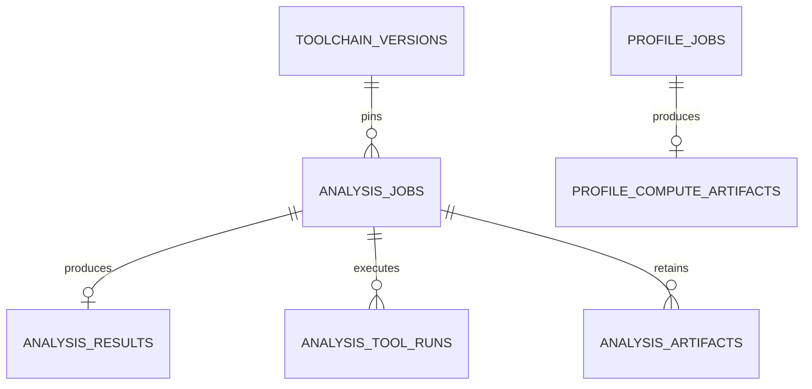

# V0.2 算法模块数据库文档

> 契约发布号 `0.2.0`。本文和《算法模块api文档》构成算法负责人的独立实施契约；旧画像/推荐仍由 backend 保存。本轮不创建数据库或业务代码。

## 1. 唯一 owner 和数据关系

algorithm 使用 PostgreSQL 私有 `algorithm` schema 与只允许该schema的数据库角色。可以与backend/judge共用PostgreSQL基础设施，但禁止使用同一写账号，不建立跨owner FK、触发器或JOIN。不将旧backend.user_analysis_snapshots等迁移为算法主数据；frontend不连接任何schema。Redis仅可加速唤醒，持久队列及结果以PostgreSQL/私有对象工件为准。

| 数据 | 唯一 owner | 算法访问/保存方式 |
|---|---|---|
| 用户/CF绑定/标准提交/训练记录 | backend | 已授权冻结HTTP DTO，不直读表、不自行抓CF |
| 用户/团队画像业务快照、报告、实际交付推荐批次 | backend | 算法计算结果供校验落库；算法工件不是用户最新事实 |
| 平台题目/不可变版本/题包与测试 | judge-problem-service | backend提供ProblemSummary冻结副本，算法不读题包/隐藏测试 |
| 提交源代码主数据 | backend | AnalysisJobRequest携带受控文本；算法仅短期工作副本 |
| 静态原始结果、工具版本/原始报告、任务执行状态 | algorithm | 下述表/算法私有桶唯一写入 |
| profile/recommend计算输入输出审计工件 | algorithm | 冻结DTO，供可复现计算；不当业务画像/交付批次 |
| analysis/profile对外投影 | backend | sourceOwner=algorithm，sourceId=analysisId/profileJobId，revision；不提供改计算事实API |

图中关系均算法schema内FK。submissionId/accountId/problemId/snapshotId是对backend/judge的逻辑引用，不是外键；source+platform+problemId组成身份，版本不参与题数去重。

## 2. 通用类型、状态和约束

PK默认UUID，时间`timestamptz` UTC，ID引用`bigint CHECK>0`且JSON序列化正十进制string，revision/count使用integer非负；SHA-256为`char(64)`小写hex；枚举使用varchar+CHECK。PK隐含非空/唯一；下面 `?` 表示可空，未标 `?` 必须非空。所有内部FK `ON DELETE RESTRICT/ON UPDATE RESTRICT`，历史结果只追加，清理遵守工件保留策略，不级联删未投递任务。

`AnalysisStatus=NOT_REQUESTED/QUEUED/RUNNING/SUCCEEDED/PARTIAL/FAILED/SKIPPED`：algorithm.analysis_jobs实际创建后只QUEUED起步，不保存NOT_REQUESTED占位。profile status=QUEUED/RUNNING/SUCCEEDED/FAILED。QUEUED/RUNNING finished_at为空，终态非空；RUNNING必须有效lease_owner和lease_expires_at，终态清空lease。revision从1递增，与状态/结果/outbox同事务。不因查询变更revision。

ToolRun状态SUCCEEDED/FAILED/SKIPPED和总任务不同：语言不适用SKIPPED不使完整C++任务PARTIAL；部分工具有效、其他适用工具失败才PARTIAL。SUCCEEDED/PARTIAL analysis有完整结果，FAILED/SKIPPED无公开result。任何单工具返回诊断并不表示工具失败。

## 3. toolchain_versions

固定工具集合、适配器、ruleset/编译模板与许可来源；已发布版本不可覆盖，同版本内容必须一致。

| 字段 | 类型 | 键/约束、用途 |
|---|---|---|
| toolchain_version | varchar(64) | PK；初始static-v0.2.1 |
| schema_version | varchar(16) | =0.2.0，统一结果结构 |
| adapter_version | varchar(64) | 初始static-adapter-v0.2.1，转换逻辑版本 |
| image_digest | text | 必须镜像sha256摘要，构建后锁定具体发行物 |
| config_sha256 | char(64) | 整套配置hash，包含执行限额 |
| tool_manifest | jsonb | array，六项tool/version/enabled/languageIds/features+安装包hash/许可引用 |
| compiler_templates | jsonb | object，languageId→固定flags/sysroot/compiler/capture配置及hash |
| rulesets | jsonb | object，tool→规则配置/hash，不接受用户任意规则/插件 |
| license_manifest | jsonb | array，每发行件sourceUrl/release/licenseFile/noticeFile/dependencyNotices |
| created_at | timestamptz | 发布创建 |
| retired_at | timestamptz? | 不再新计算，旧任务仍可复现 |

配置hash来自固定JSON规范化，不含密钥；tool_manifest每tool唯一，含LIZARD/CLANG_TIDY/INFER/RADON/PMD/CPD。工具禁用仍保留来源版本说明；capabilities.tools始终返回六项发布清单；仅部署自检通过的工具enabled=true，未安装或未通过的工具enabled=false；analysisLanguages只列真实可请求语言。镜像digest随实现构建获得，不写占位值冒充已构建镜像；更改工具或配置升级toolchainVersion。

固定初始发行基线（已核验版本存在，不要求追逐最新版）：

| 工具 | 发行版本和官方来源 | 许可/部署边界 |
|---|---|---|
| Lizard | [1.17.31](https://pypi.org/project/lizard/1.17.31/) | [MIT风格原文](https://github.com/terryyin/lizard/blob/master/LICENSE.txt)，Python依赖一起锁 |
| clang-tidy / LLVM | [18.1.8](https://github.com/llvm/llvm-project/releases/tag/llvmorg-18.1.8) | [Apache-2.0 WITH LLVM-exception及第三方许可](https://github.com/llvm/llvm-project/blob/main/LICENSE.TXT) |
| Meta Infer | [1.2.0](https://github.com/facebook/infer/releases/tag/v1.2.0) | [MIT](https://github.com/facebook/infer/blob/main/LICENSE)，capture编译器按此版本单独验证，不能假定复用LLVM18即可 |
| Radon | [6.0.1](https://pypi.org/project/radon/6.0.1/) | [MIT](https://github.com/rubik/radon/blob/master/LICENSE)，Python扩展未部署不虚报 |
| PMD / CPD | [7.6.0](https://github.com/pmd/pmd/releases/tag/pmd_releases/7.6.0) | [PMD BSD-style许可原文、DARPA致谢及第三方清单](https://github.com/pmd/pmd/blob/main/LICENSE)，不简化成未核验的纯BSD-3-Clause |

构建必须锁下载校验和、全部传递依赖、基础镜像digest，保留发行件LICENSE/NOTICE/source/revision/SBOM。工具能力依据官方[Lizard](https://github.com/terryyin/lizard)、[clang-tidy](https://clang.llvm.org/extra/clang-tidy/)、[Infer workflow](https://fbinfer.com/docs/infer-workflow/)、[Infer Cost限制](https://fbinfer.com/docs/checker-cost/)、[Radon JSON](https://radon.readthedocs.io/en/latest/commandline.html)、[PMD C++支持矩阵](https://docs.pmd-code.org/latest/pmd_languages_cpp.html)、[CPD格式/退出码](https://docs.pmd-code.org/latest/pmd_userdocs_cpd.html)。公开语言analysisSupported由backend取judge声明与本部署analysisLanguages交集，algorithm不可达false，judge不调用算法。

本轮Infer仅Bug静态分析，Cost不提供任意程序Big-O证明；PMD C++只有CPD。

## 4. analysis_jobs

| 字段 | 类型 | 键/约束、用途 |
|---|---|---|
| id | uuid | PK，对外analysisId |
| request_id | uuid | UNIQUE，backend逻辑任务幂等键 |
| request_sha256 | char(64) | JCS规范完整请求hash，同requestId异hash冲突 |
| submission_id | bigint | 逻辑backend提交ID，>0；不是FK |
| problem_source | varchar(16) | CHECK=PLATFORM |
| platform | varchar(32) | CHECK=startrack |
| problem_id | bigint | 逻辑judge题ID，>0 |
| problem_version_id | uuid | 不可空版本，逻辑引用 |
| language_id | varchar(32) | cpp17必支持，其他依capabilities |
| source_sha256 | char(64) | 原UTF8字节hash，与请求完全一致 |
| source_size_bytes | integer | 1..262144，非空白源码 |
| source_snapshot_key | text? | algorithm私有临时工作副本；清理后null，不能公开URL |
| input_metadata | jsonb | object，完整AnalysisJobRequest去掉sourceCode；保留judgeResult/版本关联，无用户真实身份 |
| toolchain_version | varchar(64) | FK→toolchain_versions.toolchain_version |
| status | varchar(24) | 任务状态CHECK，不保存NOT_REQUESTED |
| revision | integer | CHECK>=1，API revision |
| error_code | varchar(64)? | 公开TaskError.code，无堆栈 |
| error_message | varchar(1000)? | 脱敏说明 |
| error_retryable | boolean? | 有error时必非空，无error三字段全null |
| attempt_count | integer | 0..3，有效worker领取次数 |
| lease_owner | uuid? | 本次fencing token，失效worker不能写 |
| lease_expires_at | timestamptz? | 租约到期 |
| created_at | timestamptz | API createdAt，首次入队 |
| started_at | timestamptz? | 首次/本次执行开始审计 |
| updated_at | timestamptz | API updatedAt，每实际revision变更 |
| finished_at | timestamptz? | 终态完成 |
| expires_at | timestamptz? | 工作副本清理计划，不删除canonical result |

索引：UNIQUE(request_id)、(status,created_at,id)、(lease_expires_at) WHERE RUNNING、(submission_id,created_at DESC,id DESC)。不得UNIQUE(submission_id)：同提交人工retry产生新analysisId，旧结果保留。同一requestId重试只读同一job，不反复新增。

source_snapshot_key来自algorithm自己的桶前缀/私有卷，不是backend桶写权限。源码工作副本在终态后7天清理、运行时临时目录退出立即清理；需要重新分析由backend重新发新任务带其权威源码。清理不丢result/sourcehash/版本证据。

## 5. analysis_results

| 字段 | 类型 | 键/约束、用途 |
|---|---|---|
| analysis_id | uuid | PK+FK→analysis_jobs.id；每尝试最多一份发布结果 |
| schema_version | varchar(16) | =0.2.0 |
| result_hash | char(64) | SHA256(JCS完整StaticAnalysisResult去掉resultHash) |
| result_payload | jsonb | object，完整固定StaticAnalysisResult，唯一已发布静态结果事实 |
| toolchain_version | varchar(64) | FK→toolchain_versions；与job一致 |
| source_sha256 | char(64) | 与job及result_payload.reproducibility一致 |
| created_at | timestamptz | 结果首次提交时间，不事后覆写 |

result_payload完整字段：schemaVersion/analysisId/submissionId/sourceSha256/languageId/toolchainVersion/resultHash/metrics/findings/tools/reproducibility/synthesis。具体JSON型与API文档完全相同；metrics固定六指标，findings/tools必须数组，synthesis本轮NOT_REQUESTED且其他字段null。findings.tool/ruleId/message为string，severity/category封闭集合，行号>=1；API输出不包括对象存储地址/宿主路径/隐藏测试。

数据库至少校验object/array/null类型，深层类型、finite数值、tools六项唯一/实际适用状态、findingId唯一和resultHash由算法结果validator校验并事务落库。只有SUCCEEDED/PARTIAL job允许result，终态更新与result/outbox一次提交；FAILED/SKIPPED不得写假空成功结果。revision与任务snapshot保持一致。指标由固定工具负责：sourceLines=Lizard NLOC，functionCount=解析函数数、max/mean CCN=函数最大值/均值round2；CPDduplicateLines为重复物理行区间并集，maintainabilityIndex只Radon；不平均不同工具不兼容指标。

归一化result+完整v2任务/envelope及callback均最大32MiB，原始报告8MiB仅私有工具限额；超限不截断，任务FAILED ANALYSIS_RESULT_TOO_LARGE且无公开结果，不触发可用feature替换。代码创建输入2MiB限制不套给结果回调。

result_payload是冻结发布对象；下面tool_runs/artifacts是执行原始证据，同一owner内允许保存原始与归一化两个表示，不是第二个可编辑业务主数据。backend只存该对象的只读投影/sourceOwner/sourceId/revision/hash，任何改分析须新任务/新版本，双方不UPDATE老result_payload。

索引(result_hash)、(source_sha256,toolchain_version,created_at DESC)。不能仅以sourcehash跨用户复用返回的analysisId/submissionId或源码结果，否则泄露归属；若内部计算缓存只复用不含身份的tool事实，也必须重新生成本任务输出及关联。

## 6. analysis_tool_runs

| 字段 | 类型 | 键/约束、用途 |
|---|---|---|
| id | uuid | PK，原始一次工具运行 |
| analysis_id | uuid | FK→analysis_jobs.id |
| attempt_no | integer | CHECK1..3，区分worker恢复 |
| tool | varchar(24) | LIZARD/CLANG_TIDY/INFER/RADON/PMD/CPD |
| tool_version | varchar(64) | 发行件精确版本 |
| adapter_version | varchar(64) | 固定解析适配器版本 |
| config_sha256 | char(64) | 本工具规则及可信flagshash |
| status | varchar(16) | SUCCEEDED/FAILED/SKIPPED |
| exit_code | integer? | 原进程退出码，仅内部，CPD4不是失败 |
| duration_ms | bigint | >=0且JSON安全整数 |
| error_payload | jsonb? | null或TaskError object |
| report_sha256 | char(64)? | 原始报告hash |
| created_at | timestamptz | 运行开始 |
| finished_at | timestamptz | 运行完毕 |

UNIQUE(analysis_id,attempt_no,tool)、UNIQUE(id,analysis_id)，索引(analysis_id,attempt_no)。发布结果tools[]选最终有效attempt的每工具摘要；旧失败运行仍保留审计，不被最终成功覆盖。ToolRun公开不暴露exit_code路径；disabled/语言不支持SKIPPED，超时或不完整失败明示，不用stderr任意字符串当错误码。

## 7. analysis_artifacts

| 字段 | 类型 | 键/约束、用途 |
|---|---|---|
| id | uuid | PK |
| analysis_id | uuid | FK→analysis_jobs.id |
| tool_run_id | uuid? | 同任务复合FK(tool_run_id,analysis_id)→analysis_tool_runs(id,analysis_id)；任务级工件可空 |
| artifact_type | varchar(32) | SOURCE_COPY/RAW_REPORT/ADAPTER_REPORT/TOOLCHAIN_METADATA |
| storage_key | text | algorithm私有桶键，UNIQUE，不保存临时签名URL |
| sha256 | char(64) | 原字节hash |
| size_bytes | bigint | >=0 |
| media_type | varchar(128) | JSON/YAML/XML等已知类型 |
| source_owner | varchar(24) | =algorithm，该工作副本owner |
| source_id | uuid | =analysis_id，内部关联 |
| created_at | timestamptz | 建立 |
| expires_at | timestamptz? | SOURCE_COPY默认终态后7天；原始报告默认90天 |
| deleted_at | timestamptz? | 对象已删除但元数据仍可追溯 |

对象存储写入失败不提交伪有效artifact；上传临时键→校验hash→事务引用，孤立暂存对象清理。全部原始报告合计容量上限8MiB/任务，超过TOOL_OUTPUT_LIMIT，保留结构化可用证据时PARTIAL。没有通过公共API提供源码/报告下载，backend本人源码从权威backend存储读。

## 8. profile_jobs

| 字段 | 类型 | 键/约束、用途 |
|---|---|---|
| id | uuid | PK，对外profileJobId |
| request_id | uuid | UNIQUE，backend逻辑任务 |
| request_sha256 | char(64) | JCS完整ProfileJobRequesthash，输入≤32MiB |
| algorithm_version | varchar(64) | learning-profile-v0.2.1 |
| mapping_version | varchar(64) | mapping-v0.11.1 |
| source_fingerprint | char(64) | backend提供，不自行改 |
| data_cutoff_at | timestamptz | 严格窗口截止 |
| timezone | varchar(64) | =Asia/Shanghai |
| input_payload | jsonb? | 完整冻结ProfileJobRequest；仅终态保留7天后可清理 |
| status | varchar(24) | QUEUED/RUNNING/SUCCEEDED/FAILED |
| revision | integer | >=1，终态回传单调版本 |
| error_payload | jsonb? | TaskError或null |
| attempt_count | integer | 0..3 |
| lease_owner | uuid? | fencing token |
| lease_expires_at | timestamptz? | 计算前后核对 |
| created_at | timestamptz | 首次入队 |
| updated_at | timestamptz | 实际任务变化 |
| finished_at | timestamptz? | 终态时间 |

索引(request_id UNIQUE)、(status,created_at,id)、(source_fingerprint,algorithm_version)、(lease_expires_at) WHERE RUNNING。不能UNIQUE(source_fingerprint)：cutoff不同导致自然日窗口变化，应允许新任务。algorithm不知道真实用户publicId，用户级在途/幂等由backend管理，算法只按requestId管理逻辑执行。

ProfileJobRequest中accounts/submissions/problems/codeAnalysisFeatures/dimensions为强schema数组，不是backend ORM对象。eventKey跨CF重复有冲突则INVALID_INPUT，不猜最新；PLATFORM IE/CANCELLED由backend排除。problems覆盖完整ProblemRef，历史版本可并存；identity仍(source,platform,problemId)。codeAnalysisFeatures只最近可用SUCCEEDED/PARTIAL事实，可与该submission当前正在retry的analysisId不同，QUEUED/FAILED/SKIPPED不能抹掉历史可用特征。

## 9. profile_compute_artifacts

| 字段 | 类型 | 键/约束、用途 |
|---|---|---|
| profile_job_id | uuid | PK+FK→profile_jobs.id，不是用户snapshotId |
| result_payload | jsonb | object，完整ProfileResult，只包含计算结果和回显元数据，无publicId |
| result_sha256 | char(64) | JCS结果hash，内部审计，不新增公开DTO字段 |
| input_sha256 | char(64) | 与job.request_sha256一致 |
| algorithm_version | varchar(64) | 与job版本相同 |
| mapping_version | varchar(64) | 与job映射相同 |
| source_fingerprint | char(64) | 与job完全相同 |
| created_at | timestamptz | 工件生成 |

一个profileJob结果必须analyses同序7D/30D/365D/ALL，每项LearningAnalysisResult有旧Summary/六维/tag/activity、独立LearningDifficultyStat[]、sources、codeQuality。四项作为单一工件事务提交，禁止只写两窗口却SUCCEEDED。backend验证当前fingerprint/账号就绪/版本后把四份业务学习snapshot写自己schema，sourceId=profileJobId；fingerprint变化仅backend丢弃作为最新业务状态，算法工件保留原当时输入，不写新用户事实。

Summary/维度rating统计只CF_RATING，PLATFORM_RATING与UNRATED归unratedSolvedCount，难度分桶独立(scale,difficulty)；source counts按折叠事件，platform+external=submissionCount；codeQuality只有可用analysis证据。无分析不阻塞基本画像。公式及排序完整在API文档，本表存版本冻结结果，不在数据库触发器重新实现评分公式。

工件默认至少保留1年；backend历史业务快照保留策略独立，不能清算法临时输入时删backend业务历史。若需要长期完全重放，backend保留当时冻结训练元数据或算法将输入移至私有审计工件，禁止宣称仅保留hash就能复原输入。

## 10. recommendation_compute_artifacts

只审计算法一次同步计算，实际交付batch仍backend创建/保存。

| 字段 | 类型 | 键/约束、用途 |
|---|---|---|
| id | uuid | PK，内部工件ID，不返回前端batchId |
| request_id | uuid | UNIQUE，成功重试复用计算结果 |
| request_sha256 | char(64) | 同requestId异参数冲突 |
| analysis_snapshot_id | uuid | 逻辑backend ALL业务snapshot，无FK |
| source_fingerprint | char(64) | 请求冻结候选/画像来源 |
| algorithm_version | varchar(64) | learning-recommend-v0.2.1 |
| mapping_version | varchar(64) | mapping-v0.11.1 |
| source | varchar(16) | ALL/PLATFORM/EXTERNAL |
| mode | varchar(16) | LEVEL/WEAKNESS/HYBRID |
| requested_limit | integer | 1..50 |
| input_payload | jsonb? | 完整LearningRecommendRequest，7天后清理或转审计存储 |
| result_payload | jsonb | 完整LearningRecommendResponse，无业务batchId/用户名 |
| result_sha256 | char(64) | canonical输出hash |
| created_at | timestamptz | 计算完成 |

只存成功结果，空推荐同样保存。索引(analysis_snapshot_id,created_at DESC)、(source_fingerprint)。backend不需要读取此表，也不据此认定已向用户交付；algorithm即使审计工件保存失败，接口返回503而不假成功，可同request重试。缓存重放requestId必须同请求hash，与业务Idempotency-Key隔离。

## 11. callback_outbox

同一algorithm outbox承载ANALYSIS_JOB_UPDATED/PROFILE_JOB_UPDATED，禁止JUDGE事件。

| 字段 | 类型 | 键/约束、用途 |
|---|---|---|
| event_id | uuid | PK，backend inbox幂等键 |
| event_type | varchar(32) | 两种algorithm事件 |
| aggregate_id | uuid | 逻辑analysisId/profileJobId，由event_type解析所属表 |
| request_id | uuid | 原task requestId |
| revision | integer | >=1，等于payload任务revision |
| payload | jsonb | 完整CallbackEvent object，不能发部分patch |
| payload_sha256 | char(64) | 防同revision异内容 |
| delivery_status | varchar(16) | PENDING/DELIVERED/DEAD_LETTER |
| attempts | integer | >=0 |
| next_attempt_at | timestamptz | 退避调度 |
| last_error_code | varchar(64)? | 脱敏S2S错误 |
| lease_owner | uuid? | outboxworker领取token |
| lease_expires_at | timestamptz? | 宕机恢复 |
| occurred_at | timestamptz | 事件创建 |
| delivered_at | timestamptz? | backend ACK时间 |
| dead_lettered_at | timestamptz? | 24小时后未成功，仍保留可重发 |

UNIQUE(event_type,aggregate_id,revision)，索引(delivery_status,next_attempt_at,event_id)、(request_id)。事务constraint validator核对event类型/aggregate所属task/requestId/revision，不能以polymorphic FK假称直接数据库外键。Task终态/原始result和outbox写入同一事务，网络回调在事务后执行。配送worker不能更新task结果事实。

backend ACK eventId幂等、task current id及revision单调；同revision不同payloadHash409 EVENT_CONFLICT。sourceOwner固定algorithm。网络失败1,2,4,8,16,30秒退避24h死信；后台每30秒轮询/终态对账补漏，不能只Redis pubsub。成功投递至少保存event唯一键1年用于审计，canonical结果不因ACK删除。

## 12. 旧模型保留及新旧数据关系

旧algorithm仍六个v1同步端点，可完全无算法持久化副作用完成；下列backend表只是HTTP输入来源/输出去向，algorithm角色无SELECT/INSERT/UPDATE权限。字段完整DTO在本模块API第9节，可独立实施而无需其他负责人源代码。

| 旧表/对象（backend owner） | 算法需要理解的字段/类型 | 关联/约束及用途 |
|---|---|---|
| oj_accounts→UserSourceAccount | accountId:Id/platform=codeforces/dataVersion:Id/currentRating,maxRating:number\|null | accountId引用一次绑定；重绑新ID，不按handle归属迁移 |
| problems→AlgorithmProblem | problemId:Id/difficulty:number\|null/tags:string[]/solvedCount:number\|null/isGym:boolean | 与旧submission.problemId非空关联；Gym/未评级可统计不入推荐候选 |
| submissions→AlgorithmSubmission | externalSubmissionId:Id/problemId:Id/verdict:Verdict/submittedAt:Instant | 旧account内externalId唯一；原始CF内存字节/语言不需要算法补造 |
| V0.12 UserAlgorithmSubmission | accountId:Id/platform=codeforces/externalSubmissionId:Id/problemId:Id/verdict/submittedAt | 用户跨账号eventKey去重，冲突拒绝；不能平均账号画像代替去重 |
| skill_dimensions/tag_skill_mappings→DimensionConfig | code/name/displayOrder/tagMappings[{tag,weight}] | 六项mapping-v0.11.1；同version内容不可改，后端种子/算法本地相同 |
| analysis_snapshots/analysis_dimension_scores | requestId/账号ID/窗口/cutoff/sourceDataVersion/algorithmVersion/mappingVersion + AnalysisResult | backend旧账号画像；四窗口同事务，六维恰六项，历史不覆盖 |
| user_analysis_snapshots | requestId/sourceFingerprint + 四AnalysisResult、sourceAccountCount/ratingAccounts | backend旧多CF画像；旧字段不加入平台来源，不迁移算法schema |
| recommendation_batches/items | accountId/batchId/analysisSnapshotId/mode/targetRating/targetDimension/版本/candidateCount/rank/score/reasonCode/problemSnapshot | backend交付owner；算法只输出problemId排序和原因码，不产生batchId |
| personal_analysis_reports | ALL/30D snapshot refs、sourceFingerprint/content/reportVersion/promptVersion/modelName | backend历史报告；算法只聚合输入，无publicId/邮箱/源码 |
| team_analysis_snapshots | teamId/audience/fingerprint/memberCount/能力与训练样本引用/TeamAnalyzeResponse | backend分别授权能力/基础训练输入；算法不接触privacy设置 |
| team_recommendation_batches/items | teamId/analysisSnapshotId/fingerprint + TeamRecommendResponse | backend交付owner；coverage来自详细提交权限，公开不输出成员已做数 |
| ai_jobs/sync_jobs | requestId/subject/fingerprint/lease/errors/resultRef | backend旧任务owner；不是algorithm新的analysis/profile_job任务表 |

旧Summary完整字段：attemptedProblemCount/solvedCount/unsolvedProblemCount/submissionCount/acceptedSubmissionCount/failedSubmissionCount/pendingSubmissionCount/ratedSolvedCount/unratedSolvedCount/averageSolvedDifficulty/maxSolvedDifficulty/activeDays；前九和activeDays整数，平均number|null、最高integer|null。旧AnalysisResult包含window/period/currentRating/maxRating/overallScore/dimensions/weakestDimension/tagStats/difficultyStats/activityStats；旧DifficultyStat没有scale字段。新LearningAnalysisResult只有difficultyStats独立类型和sources/codeQuality扩展，旧DTO不增字段。

旧TagStat(tag、尝试题/解题/提交计数)，旧ActivityStat(date、提交/AC/failed/pending/窗口首次AC题数)，旧DimensionScore(code/name/order/score、尝试/解题/提交、平均评级、rankOrder)保持类型与统计口径。CF rating缺失保持null、CF solvedCount是公开通过人数不是通过率；tags/语言原值不是封闭枚举。

旧团队勘误不改表/DTO：targetRating=NULL iff levelMemberCount=0；coverageMemberCount与includedMemberCount属独立隐私集合，不能要求前者≤后者，实际上限memberCount由backend校验。旧团队/个人报告仍CF-only，加入平台业务以后另发隐私/报告版本。

## 13. 迁移、恢复和验收边界

仅算法负责人在algorithm schema依次创建toolchain_versions→analysis_jobs→analysis_results/tool_runs/artifacts→profile_jobs/profile_compute_artifacts→recommendation_compute_artifacts→callback_outbox和索引。迁移不改旧backend表、不把用户/题目ID重新编号、不改变CF提交非空FK；新平台提交仍backend单独表复用旧提交sequence（算法只理解Id不执行其分配）。每服务独立Docker构建、Migration凭据范围仅自身schema。

算法任务事务只涉及自身表，跨HTTP不持事务；worker SKIP LOCKED短事务领取、lease失效只能废弃本次未提交结果。并发同requestId仅一条任务；同task多个worker只有效fencing owner可提交。任务恢复+outbox恢复都必须在容器重启自检后运行，不依赖丢失内存引用。

数据库验证重点：请求键异内容冲突；sourcehash与UTF8原码一致；历史结果不可覆盖；analysis PARTIAL有证据/FAILED无伪成功；四窗口完整结果原子提交；无跨schema外键/写权限；同裸problemId不同source不合并；复制投影标owner/id/revision；旧分析重试不清最近可用feature；失效lease拒写；result+outbox事务原子；重复/乱序回传不推进backend训练与分析版本；工件清理不删除业务历史。工具与模块HTTP验收详本模块API，仅生成设计文档，不在本轮安装/运行上述工具或建表。
